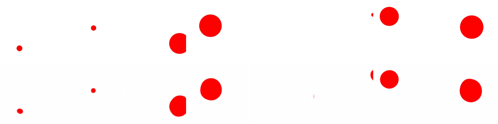
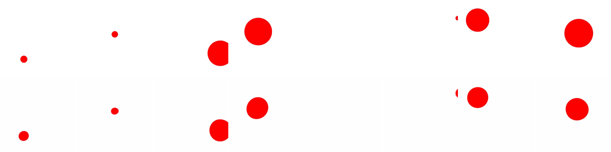

# wm — World Model experiments

> 中文版：[`README.zh.md`](./README.zh.md)
>
> **Path note (2026-05)**: this tree was renamed `agent_memory/` → `am/`. All paths are now `~/am/wm/...`. A symlink `~/lewm_run -> ~/am/wm/le-wm` exists for launching training.

Three related projects sit side by side here:

| Subdir | What it is | Upstream |
|---|---|---|
| [`le-wm/`](./le-wm/) | **LeWorldModel**: JEPA-style action-conditioned world model trained from pixels. Includes training, planning, evaluation. | https://github.com/lucas-maes/le-wm |
| [`phyworld/`](./phyworld/) | **How Far is Video Generation from World Model**: physical-law benchmark with code to generate / evaluate ID & OOD video data (uniform motion, collision, parabola). | https://github.com/PhyWorld/PhyWorld |
| [`PIWM/`](./PIWM/) | **Physically Interpretable World Models**: latent↔physics alignment + physics-structured dynamics. Design source for the deep-supervision experiments. | arXiv:2412.12870 / 2503.02143 |

The reason they're together: phyworld's data tests whether a video / world model has actually learned physics. We feed phyworld trajectories into `le-wm` and probe how the JEPA encoder + predictor behave on this benchmark; PIWM supplies ideas for *improving* that behavior.

**Method references for the deep-supervision experiments:**
- *Physically Interpretable World Models via Weakly Supervised Representation Learning* — arXiv:2412.12870 (latent↔physics alignment; principle 1)
- *Four Principles for Physically Interpretable World Models* — arXiv:2503.02143 (the four design principles)
- *Improving World Models using Deep Supervision with Linear Probes* — arXiv:2504.03861 (the linear-probe-in-loss recipe we actually implement: adds a linear probe term to the next-frame-prediction loss → better decodability + reduced rollout drift)

For project-internal docs see [`le-wm/README.md`](./le-wm/README.md) and [`phyworld/README.md`](./phyworld/README.md). This README covers the **bridge between them** + an index of the experiment reports.

---

## Experiment reports (latest → oldest)

All under [`reports/`](./reports/). New readers should start with three reports:

1. **Source of truth (qlib origin)**: [`reports/5-26/negtive_result_report.md`](./reports/5-26/negtive_result_report.md) — the main empirical findings.
2. **Latest fixed-init re-run**: [`reports/6-2/piwm_three_domains_A800.md`](./reports/6-2/piwm_three_domains_A800.md) — 2026-06-08 A800 rerun with init bug fixed.
3. **Methodology / red-flags**: [`reports/6-24/diagnostic_report.md`](./reports/6-24/diagnostic_report.md) — why K=4 ρ / latent cos can mislead, and how to diagnose deep-sup correctly.

> ⚠️ **A500 init-bug warning** (2026-06-07). All A500-trained ckpts between 2026-06-05 and 2026-06-07 had `init_from_ckpt` silently drop 192 of 216 ViT-body weights due to a transformers naming drift (`encoder.encoder.layer.N.attention.attention.{q,k,v}` → `encoder.layers.N.attention.{q,k,v}_proj`). Affected reports are marked "❌ broken init" below; do NOT cite their numbers. Fix is in [`le-wm/train.py`](./le-wm/train.py) (`_remap_old_vit_keys()` + load guard). Any future train must show `[init_from_ckpt] loaded=216 unexpected=0` in its log.

### Report index (status-tagged)

| Report | Date | Topic | Status |
|---|---|---|---|
| [6-2/decoder_viz/README.md](./reports/6-2/decoder_viz/README.md) | 2026-06-26 | **Embedding→image decoding**: train a pixel decoder on a frozen encoder to *see* what the latent encodes; finetuning helps ID decodability but **hurts OOD reconstruction by ~5 dB** | ✅ valid (pusht loaded=198/198) |
| [6-24/diagnostic_report.md](./reports/6-24/diagnostic_report.md) | 2026-06-24 | **Diagnostics manual**: probe-loss duality of K=4 ρ; pred_loss as ground truth; intrinsic dim collapse; encoder/target swap | ⚠️ method valid, numbers from broken-init ckpts (re-run pending) |
| [6-2/piwm_three_domains_A800.md](./reports/6-2/piwm_three_domains_A800.md) | 2026-06-08 | **Fixed-init re-run** of 3 domains × 4 arms (baseline / pos-only / pos+vel / mf4); supersedes the broken-init sweep | ✅ valid (loaded=216) |
| [6-2/sweep_three_domains_results.md](./reports/6-2/sweep_three_domains_results.md) | 2026-06-06 | 45-config λ×frames sweep across 3 domains (broken-init) | ❌ broken init; kept as a debugging log only |
| [6-2/piwm_three_domains.md](./reports/6-2/piwm_three_domains.md) | 2026-06-02 | qlib-original 3-domain deep-sup comparison; within-traj-std hypothesis for single-vs-multi-frame probe | ✅ valid (qlib origin) |
| [6-2/piwm_uniform_collision_results.md](./reports/6-2/piwm_uniform_collision_results.md) | 2026-06-02 | qlib-original uniform + collision data tables | ✅ valid (qlib origin) |
| [6-2/idea-stage/IDEA_REPORT.md](./reports/6-2/idea-stage/IDEA_REPORT.md) | 2026-06-01 | Idea discovery — proposals for next-step research (PhysConsist-Rollout, etc.) | ✅ planning doc |
| [5-26/negtive_result_report.md](./reports/5-26/negtive_result_report.md) | 2026-05-26 | **Main report**: probe protocol/metric fixes; pusht-only zero-shot already ρ≈0.9; ID-only FT gain ≈ 0 | ✅ valid (qlib origin) |
| [5-26/piwm_deepsup_results.md](./reports/5-26/piwm_deepsup_results.md) | 2026-05-26 | PIWM deep-sup linear-probe in FT loss; single-frame harms vx-OOD, `frames=4` recovers | ✅ valid (qlib origin) |
| [5-26/rollout_results.md](./reports/5-26/rollout_results.md) | 2026-05-26 | AR rollout (ARPredictor): 1-step great, multi-step drifts; collision drifts fastest | ✅ valid (qlib origin) |
| [5-26/arpredictor_rollout_proposal.md](./reports/5-26/arpredictor_rollout_proposal.md) | 2026-05-26 | Proposal doc for the rollout experiment | ✅ valid (qlib origin) |
| [5-19/FINAL_REPORT.md](./reports/5-19/FINAL_REPORT.md) | 2026-05-19 | Can LeWM learn Newtonian laws? Full phyworld experiment | ⚠️ partly superseded (R²-era metric) |
| [5-19/DIT_REPORT.md](./reports/5-19/DIT_REPORT.md) | 2026-05-19 | DiT-XL-2 on phyworld collision (zero-shot + LoRA + LeWM pusht-only) | ⚠️ partly superseded |
| [5-19/finetune_analyze.md](./reports/5-19/finetune_analyze.md) | 2026-05-19 | Why SSL FT on collision makes the probe worse | ⚠️ partly superseded |
| [5-12/COLLISION_REPORT.md](./reports/5-12/COLLISION_REPORT.md) | 2026-05-12 | LeWM on phyworld collision — early report | ⚠️ R²-era, superseded by 5-26 |
| [5-12/UNIFORM_MOTION_REPORT.md](./reports/5-12/UNIFORM_MOTION_REPORT.md) | 2026-05-12 | LeWM on phyworld uniform motion — early report | ⚠️ R²-era, superseded by 5-26 |
| [5-12/SLIDES.md](./reports/5-12/SLIDES.md) | 2026-05-12 | Slide deck of early findings | — |

---

## Environment

A single `uv` venv lives in [`le-wm/.venv/`](./le-wm/) (Python 3.10, `torch==2.9.1+cu128`, `stable-worldmodel[train,env]`, plus `imageio`, `Pillow`, `h5py` already pulled in transitively). All commands below use it.

```bash
cd ~/am/wm/le-wm
source .venv/bin/activate
```

If the venv ever needs to be rebuilt:

```bash
cd ~/am/wm/le-wm
uv venv --python=3.10
source .venv/bin/activate
uv pip install swig                       # box2d-py needs the swig binary at build time
cat > /tmp/lewm-build-constraints.txt <<'EOF'
setuptools<=66.0.0
wheel<=0.38.4
pip<=23.0.1
EOF
uv pip install --build-constraints /tmp/lewm-build-constraints.txt 'stable-worldmodel[train,env]'
uv pip install -U 'datasets>=2.14,<4'     # upstream pin is too old (1.1.1)
# system has CUDA 12.9 driver, swap default cu130 wheel for cu128:
uv pip install --reinstall --index-url https://download.pytorch.org/whl/cu128 \
  'torch==2.9.1+cu128' 'torchvision==0.24.1+cu128'
```

---

## Datasets

Datasets live at `$STABLEWM_HOME` (defaults to `~/.stable_worldmodel/`). `stable_worldmodel.HDF5Dataset` looks up `<name>.h5` there.

| File | Source | Size | Notes |
|---|---|---|---|
| `pusht_expert_train.h5` | LeRobot pusht (HF: `quentinll/lewm-pusht`) | 44 GB | Reference dataset for `le-wm`. 2.3M frames, 18685 episodes, action+proprio+state. |
| `phyworld_{uniform_motion,parabola}.h5`, `phyworld_collision_eval.h5` | converters below | ~100 MB | **Eval sets** (all 4 partitions: ID + r/m-OOD + v-OOD + both-OOD). Used for probing / rollout. |
| `phyworld_{collision,uniform_motion,parabola}_id1k.h5` | converters, `--limit 1000` on official `*_30K.hdf5` | ~100-160 MB | **ID-only training sets** (1000 traj, 32k frames, 100% ID). For leak-free ID→OOD FT. Built from HF `magicr/phyworld` `id_ood_data/*_30K.hdf5`. |

Converters: [`convert_to_lewm.py`](./phyworld/scripts/convert_to_lewm.py) (uniform/parabola, action=velocity), [`convert_collision_to_lewm.py`](./phyworld/scripts/convert_collision_to_lewm.py) (collision, action=acceleration). **Action semantics differ per domain** — uniform/parabola use velocity, collision uses acceleration; the LeWM `action_encoder` dim must match (2 vs 4).

---

## phyworld → le-wm bridge

### What [`convert_to_lewm.py`](./phyworld/scripts/convert_to_lewm.py) does

phyworld's hdf5 stores each trajectory as an MP4 byte-blob in `video_streams/<group>/<idx>` and 2D positions in `position_streams/...`. It has **no action signal** — it's a passive physics dataset.

le-wm wants a single flat-stacked hdf5 with `pixels`, `action`, `proprio`, `ep_len`, `ep_offset`, `episode_idx`, `step_idx`.

The script:

1. Decodes each trajectory's MP4 → `(T, H, W, 3)` uint8.
2. Resizes to `--img-size` (default 224, matches le-wm's `img_size`).
3. Uses `position[t]` directly as `proprio[t]`.
4. **Synthesises** `action[t] = position[t+1] - position[t]` (velocity). Reason: le-wm's column normalizer divides by `std`; an all-zero `action` would produce NaNs. Velocity is also a physically sensible "control" for uniform motion.
5. Writes ep bookkeeping (`ep_len = 32` per traj, etc.).

Run from the `phyworld/` dir (so default `--src` resolves to `data/uniform_motion_eval.hdf5`):

```bash
cd ~/am/wm/phyworld
python scripts/convert_to_lewm.py
# -> writes ~/.stable_worldmodel/phyworld_uniform_motion.h5  (~100 MB, 2-3 min)
```

Useful flags:

```bash
python scripts/convert_to_lewm.py --limit 4 --dst /tmp/phyworld_test.h5  # quick check
python scripts/convert_to_lewm.py --img-size 256 --name phyworld_um256   # custom output
python scripts/convert_to_lewm.py --src path/to/other_phyworld.hdf5      # different source
```

### le-wm config for phyworld

Already created at [`le-wm/config/train/data/phyworld.yaml`](./le-wm/config/train/data/phyworld.yaml):

```yaml
dataset:
  name: phyworld_uniform_motion          # → ~/.stable_worldmodel/phyworld_uniform_motion.h5
  num_steps: ${eval:'${wm.num_preds} + ${wm.history_size}'}
  frameskip: 1                           # phyworld traj is only 32 frames; no skip
  keys_to_load: [pixels, action, proprio]
  keys_to_cache: [action, proprio]
```

Differences vs `pusht.yaml`: `frameskip=1` (was 5) because trajectories are short; no `state` key (phyworld has no env truth state).

---

## Running training

### Smoke test — verifies the whole pipeline in ~10 s

```bash
cd ~/am/wm/le-wm
source .venv/bin/activate

CUDA_VISIBLE_DEVICES=2 WANDB_MODE=disabled python train.py \
  data=phyworld \
  output_model_name=lewm_phyworld \
  wandb.enabled=False \
  trainer.max_epochs=1 \
  +trainer.limit_train_batches=2 \
  +trainer.limit_val_batches=1
```

Success looks like:

```
Trainer.fit stopped: `max_epochs=1` reached.
Epoch 0/0 ━━━━━━━ 2/2 0:00:03
fit/pred_loss = 0.24    fit/sigreg_loss = 40.0
```

For pusht swap `data=pusht` and drop the `output_model_name` override (or use a different name).

### Full training

```bash
CUDA_VISIBLE_DEVICES=2 python train.py \
  data=phyworld \
  output_model_name=lewm_phyworld \
  wandb.enabled=False
# checkpoints land in ~/.stable_worldmodel/lewm_phyworld_epoch_<N>_object.ckpt
```

To enable W&B, edit [`le-wm/config/train/lewm.yaml`](./le-wm/config/train/lewm.yaml) and set `wandb.config.entity / project`, then drop `wandb.enabled=False`.

---

## Deep-supervision probe (PIWM-style) — added in `lewm.yaml`

Recipe from *Improving World Models using Deep Supervision with Linear Probes* (arXiv:2504.03861), realizing PIWM principle 1 (arXiv:2412.12870). LeWM FT adds a linear probe loss that aligns the projector-space emb with physical state. Off by default → baseline unchanged; toggle for ablation. Config block in [`le-wm/config/train/lewm.yaml`](./le-wm/config/train/lewm.yaml):

```yaml
loss:
  probe:
    enabled: false          # true = +probe arm
    weight: 1.0
    target: proprio         # single col, or list e.g. [proprio, action] (pos+vel)
    frames: 1               # 1 = single-frame probe; K>1 = stack K frame embs (velocity-decodable)
```

Key result ([reports/5-26/piwm_deepsup_results.md](./reports/5-26/piwm_deepsup_results.md)): **single-frame** probe (`frames=1`) helps position / vy / long-horizon cos but **damages vx on high-speed OOD** (single frame can't encode instantaneous velocity). **Multi-frame** (`frames=4`, `target=[proprio,action]`) is the fix — recovers vx and gives the best long-horizon rollout cosine. Example:

```bash
cd ~/lewm_run && CUDA_VISIBLE_DEVICES=0 .venv/bin/python -u train.py \
  data=phyworld_parabola_id1k loss.probe.enabled=true \
  'loss.probe.target=[proprio,action]' loss.probe.frames=4 \
  output_model_name=lewm_parabola_piwm_mf4_id1k subdir=parabola_piwm_mf4_id1k \
  trainer.max_epochs=20 +init_from_ckpt=~/.stable_worldmodel/lewm_paper_pusht/weights.pt
```

Eval / AR-rollout: [`phyworld/scripts/rollout_eval_id1k.py`](./phyworld/scripts/rollout_eval_id1k.py) (`--ckpt`/`--tag` to swap arms; reports latent cos vs horizon/partition + K=1/K=4 decoded pos/vel ρ).

---

## Embedding → image decoding (interpretability)

Probe ρ tells you the latent is *linearly decodable* into physics, but it's an abstract number that can mislead (see [6-24 diagnostics](./reports/6-24/diagnostic_report.md)). The most direct check is to **decode the latent back into a picture** and look: if the ball reappears in the right place, the latent really encodes position. This is the "Plan A" experiment — the LeWM paper's App. D mentions such a decoder but **never open-sourced it**, so it's trained from scratch here.

```
real frame ──[frozen encoder]──> latent (192-d CLS) ──[decoder]──> reconstructed frame
```

Code in [`le-wm/decode_viz/`](./le-wm/decode_viz/) (`decoder.py` / `train_decoder.py` / `eval_decoder_ood.py`). Because the encoder is frozen, all embeddings are precomputed once and only the small upsampling decoder is trained (~10 min, single GPU). Full writeup + all images: [`reports/6-2/decoder_viz/README.md`](./reports/6-2/decoder_viz/README.md).

**Reconstruction works** — on `uniform_motion` with the **un-finetuned pusht encoder**, the 192-d CLS latent reconstructs the ball at the correct position/size (val PSNR **34.85 dB**). Top row = ground truth, bottom row = decoder output from the latent alone:


→ confirms **the pretrained (un-finetuned) encoder already encodes ball position**, no PhyWorld finetuning needed — a visual echo of "pusht-only zero-shot is already ρ≈0.9" from the [main report](./reports/5-26/negtive_result_report.md).

### Finetuned vs un-finetuned, on OOD — a counter-intuitive finding ⭐

Same data, two encoders (each gets its own decoder, CLS token, identical config), evaluated on the OOD eval set per partition:

| partition | un-finetuned pusht | finetuned paperinit | Δ |
|---|---|---|---|
| **ID** | 33.84 dB | 34.17 dB | +0.3 (tie) |
| **r/m-OOD** (unseen size) | **25.34 dB** | **19.89 dB** | **−5.4 ↓↓** |
| **v-OOD** (unseen speed) | 34.95 dB | 35.32 dB | +0.4 (tie) |
| **both-OOD** | **25.86 dB** | **21.11 dB** | **−4.8 ↓↓** |

Finetuning makes the latent **more decodable on ID** (its own val hits 40.2 dB vs 34.9) but **clearly worse on position-OOD** (−5 dB). The grids show why: the finetuned decoder still gets position right but **snaps OOD ball sizes back toward the ID-typical size** — finetuning overfit the representation to the ID distribution and discarded the OOD-only appearance feature (ball size = the `r/m` parameter). `v-OOD` doesn't drop on either side, a clean sanity check: a single frame's appearance depends on position, not speed.

both-OOD, un-finetuned (sizes preserved) vs finetuned (sizes collapse toward ID):




**Takeaway**: judging finetuning by "ID latent is more decodable" is dangerous — it can just mean the representation overfit to ID at the cost of OOD information. Pixel decoding makes this visible, and is more trustworthy than probe ρ. Same message as the [6-24 diagnostics](./reports/6-24/diagnostic_report.md), now as a picture.

```bash
# train a decoder on a frozen encoder (default ckpt = un-finetuned pusht weights.pt)
le-wm/.venv/bin/python le-wm/decode_viz/train_decoder.py --domain uniform_motion \
  --epochs 40 --out /data1/likun-share/junjxu/runs/decoder_viz/uniform_pusht
# eval its OOD reconstruction per partition
le-wm/.venv/bin/python le-wm/decode_viz/eval_decoder_ood.py --domain uniform_motion \
  --ckpt <encoder> --decoder <decoder_best.pt> --emb-source cls --tag <name> --out <dir>
```

---

## Caveats / known issues

- **Auto-resume on collision**: le-wm auto-resumes from `~/.stable_worldmodel/<output_model_name>_weights.ckpt` if it exists. Switching `data=` between datasets changes the action_dim → state_dict shape mismatch. Use a distinct `output_model_name` per task (the example above does).
- **phyworld is not a real training set**: 36k frames of one-ball uniform motion is far too small + too simple for serious WM training; it's an *evaluation* set. For meaningful training generate larger sets via `phyworld/id_ood_data/*.py` (30k–3M videos) and rerun the converter pointing at the new hdf5.
- **action is synthetic** for phyworld. The model effectively learns near-unconditional next-frame prediction. Do not interpret loss curves as "le-wm learned physics from phyworld" — see the project root [`phyworld/README.md`](./phyworld/README.md) for the intended evaluation protocol.
