# Embedding → 图像 解码可视化（decoder viz）

**日期**：2026-06-26
**一句话**：训练一个像素 decoder，把 LeWM 编码器的 192 维 latent 直接还原成图像，**直观地看 latent 里到底编码了什么**。首测用 **uniform_motion（匀速直线，单红球）+ 未微调的 pusht 编码器**。

---

## 1. 为什么做这个

报告里一直用"探针 ρ（latent → 物理量的可解码性）"来间接判断 latent 是否编码了球的位置/速度。但 ρ 是个抽象数字，容易误导。**最直接的办法是把 latent 解码回图像**——如果球能还原到正确的位置，就说明 latent 真的编码了位置。

这正是之前会话里讨论的 **"Plan A（一锤定音）"**：

```
真实帧 ──[冻结编码器]──> latent(192维 CLS) ──[decoder]──> 重建帧
```

> LeWM 论文附录 D 提到过这种 decoder，但**代码没开源**，所以这里是从头自己训的。
> 因为编码器是冻结的，每帧的 latent 是固定的 → 先一次性预计算所有 latent，再只训 decoder，很快（全程约 10 分钟 / 单卡）。

---

## 2. 怎么看这几张图

每张 PNG 是一个 8 列的对比网格：

- **上排** = 真实帧（ground truth，从数据集里取的原图）
- **下排** = decoder 仅凭该帧的 192 维 latent 还原出来的图

**8 列是 8 个不同的验证样本**（球在不同位置）。下排越接近上排，说明 latent 保留的信息越完整。

> 📌 **本节（§2 / §2.1）所有重建图，都是用「未经 finetune」的原始 pusht encoder 生成的**（只在 PushT 上预训练，从未在 phyworld 上微调）。decoder 只是个训练出来的"读出器"，被研究的 encoder 本身没动过——这些图反映的是**原始 encoder 的 latent 里保留了多少信息**。

**① ep001 — 只训练 1 轮**：球的位置已经大致对上了，但有的样本糊、有的丢球——说明位置信息"一开始就在 latent 里"，decoder 很快就能读出来。

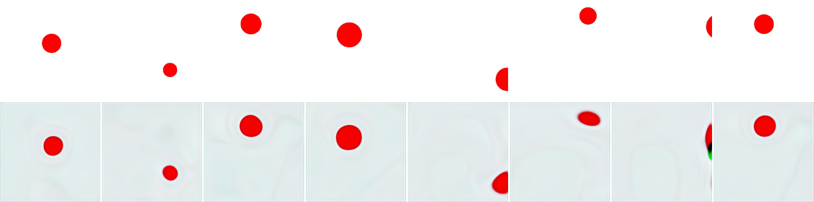

**② ep005 — 训练 5 轮**：明显变清晰。

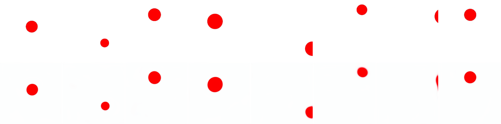

**③ ep030 — 训练 30 轮**：基本收敛。

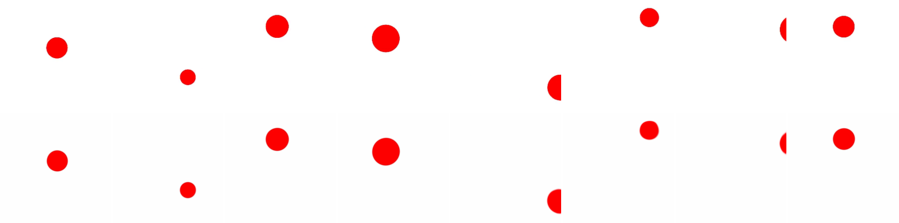

**④ final（40 轮）**：下排与上排几乎一致。

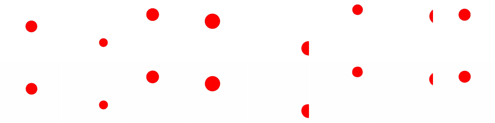

> ⚠️ **注意**：上面 4 张网格的 **8 列是 8 条不同轨迹的样本**，所以球大小各不相同——这是 PhyWorld 故意把球半径随机化（16~28 px，即 `r/m-OOD` 球大小维度），**不是重建 bug**。同一条轨迹内球大小是固定的。数据集是 **`uniform_motion`（匀速直线运动）**：球只沿水平方向匀速移动（proprio 的 y 恒定），所以不是抛物线。

### 2.1 同一条轨迹的最后 8 帧（看末端小球还原）

为避免"8 列是不同球"的混淆，下图改成**单条轨迹（episode 434）按时间顺序的最后 8 帧**（step 24→31），球从 x=8.80 匀速走到 x=11.00、逐渐逼近画面右边缘。上排 GT、下排重建：

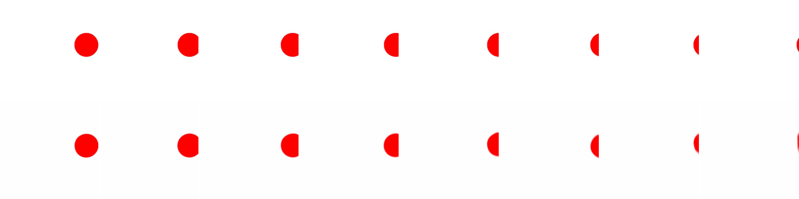

> 📌 **此图同样由「未经 finetune」的原始 pusht encoder 生成**（非微调模型）。

- **球大小全程恒定**（同一条轨迹），可干净地只看"位置"还原。
- 末尾几帧球已贴到右边缘、被画框裁掉一半——下排重建**连这个边缘裁切都跟上了**，位置没有偏移。
- 旁注：匀速运动若速度够大，球会在轨迹末端**直接飞出画框**（后几帧纯白）。本图已自动挑选"最后 8 帧球仍全程在画面内"且位移最大的轨迹。

---

## 3. 结论

- 仅凭 **192 维 CLS embedding**，decoder 就能把红球还原到**正确的横向位置和大小**，背景干净。
- 验证集 **PSNR 达到 34.85 dB**（MSE 0.00033），重建质量很高。
- **关键**：用的是**未经微调的 pusht 编码器**（`loaded=198/198`，确认是真预训练权重、非随机初始化）。也就是说——

  > **预训练编码器的 latent 本身就已经编码了球的位置信息**，不需要在 PhyWorld 上微调。

  这和报告里"未微调编码器探针 ρ 已经不低"的结论相互印证，而且**更直观、更可信**（绕开了所有 latent 度量的循环逻辑）。

---

## 4. 复现

代码：[`le-wm/decode_viz/`](../../../le-wm/decode_viz/)
- `decoder.py` — decoder 网络（192维 → 224×224×3 的上采样卷积网络）+ 冻结编码器加载
- `train_decoder.py` — 预计算 latent → 训练 decoder → 存对比图（单 encoder 的基础可视化，§3）
- `train_universal_decoder.py` — ID+OOD 全分布通用 decoder（§5 的正确对比方法）

```bash
cd /home/likun-share/junjxu/wm
export STABLEWM_HOME=/data1/likun-share/junjxu/.stable_worldmodel
export HF_HOME=/data1/likun-share/junjxu/.cache_huggingface

# 未微调 pusht 编码器（默认），uniform_motion，40 轮
CUDA_VISIBLE_DEVICES=0 le-wm/.venv/bin/python le-wm/decode_viz/train_decoder.py \
  --domain uniform_motion --epochs 40 \
  --out /data1/likun-share/junjxu/runs/decoder_viz/uniform_pusht
```

完整训练产物（所有 epoch 的图、decoder 权重、日志）在：
`/data1/likun-share/junjxu/runs/decoder_viz/uniform_pusht/`

---

## 5. 对比实验：微调 vs 未微调，重点看 OOD 泛化 ⭐

**问题**：在 PhyWorld 上微调编码器，会不会损害它对 OOD（未见球大小/速度）的"保信息能力"？用像素解码直接看。

**设置**：同一份 uniform_motion，**三个**编码器各测一遍，唯一变量是编码器有没有微调、微调时加不加 probe：
- **未微调**：pusht `weights.pt`（`loaded=198/198`，确认真预训练权重）
- **微调（无 probe）**：`uniform_motion_paperinit_id1k` epoch 20（标准 LeWM FT，probe.weight=0，从 pusht 初始化）
- **微调（pos-only probe，λ=1）** ⭐：`uniform_motion_piwm_probe_id1k` epoch 20（FT + 单帧位置 probe，`target=proprio frames=1 weight=1.0`）

在 **OOD eval 集**（1152 条轨迹，按初始条件分 4 区）上测每个分区的重建 PSNR。
分区：`ID` / `r/m-OOD`（未见的球**大小/半径**）/ `v-OOD`（未见的**速度**）/ `both-OOD`。

### 5.1 ⚠️ 必须用"通用 decoder"——否则 confound 会伪造结论

最直觉的做法是给每个 encoder 在它自己的 **ID latent** 上训一个 decoder，再去测 OOD。**这是错的**：测 OOD 时 decoder **从没见过 OOD 的球大小**，重建差里混了两个原因——(1) encoder 真丢了 OOD 信息（想测的），(2) decoder 没见过 OOD 外观、读不出来（confound，与 encoder 无关）。ID-only decoder 区分不了这两者。

> **这个 confound 有多大？** 实测用 ID-only decoder，微调版的 r/m-OOD 会比通用 decoder **低 13–14 dB**（paperinit 19.89 → 33.87、pos-only 21.76 → 35.17），足以把真实排序**完全颠倒**、伪造出"微调伤 OOD、不微调反而最好"的假象。任何"latent 解码质量"的对比都必须用见过全分布的 decoder。这又是"指标循环逻辑"的一个实例（参见 [6-24 诊断报告](../../6-24/diagnostic_report.md)）。

**正确做法（本节采用）**：训一个**通用 decoder**——在 eval 集的 **ID + 全部 OOD 分区**上、**按轨迹** 80/20 切分（无帧泄漏）训练，再在 held-out 上按分区测。decoder 见过 OOD 球大小后，重建若还差，就**纯粹是 encoder 丢了信息**。脚本：[`train_universal_decoder.py`](../../../le-wm/decode_viz/train_universal_decoder.py)。

### 5.2 结果（通用 decoder，held-out PSNR，越高越好）

| 分区 | pusht (不微调) | paperinit (λ=0) | **pos-only (λ=1)** ⭐ |
|---|---|---|---|
| **ID** | 33.00 | 35.14 | **37.38** |
| **r/m-OOD**（未见大小）| 31.72 | 33.87 | **35.17** |
| **v-OOD**（未见速度）| 33.61 | 34.24 | **37.32** |
| **both-OOD** | 33.06 | 34.84 | **36.25** |

**pos-only (λ=1) 逐分区重建网格**（上排=真实帧 GT，下排=仅凭 latent 的重建；8 列=8 个 held-out 样本）：

| 分区 | 图 |
|---|---|
| ID (37.38 dB) | 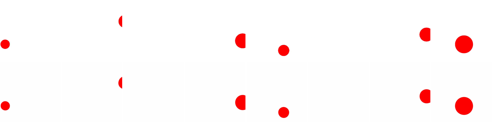 |
| r/m-OOD (35.17 dB) |  |
| v-OOD (37.32 dB) | 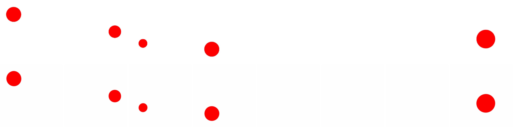 |
| both-OOD (36.25 dB) | 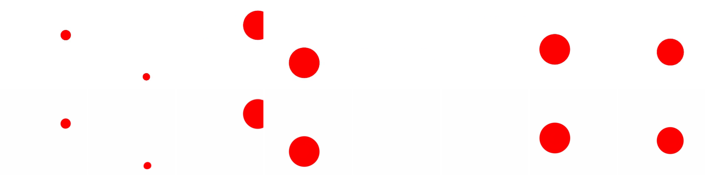 |

> 看 **r/m-OOD / both-OOD**：GT 里有大小不一的球（含明显偏大的 OOD 尺寸），下排重建在**位置和大小上都对得上**——直接证明微调后的 encoder **没丢 OOD 球大小信息**（§5.3 结论①的视觉铁证，推翻了"微调把 OOD 球拉回 ID 大小"的旧说法）。

### 5.3 结论 ⭐

1. **微调的 encoder 没有丢 OOD 信息**。OOD 信息一直在 latent 里——每个 encoder 的 ID-vs-OOD 差距只有 **~0–2 dB**，所有 encoder 都很好地保留了 OOD 外观（球大小）。
2. **微调把整体重建质量抬高了，并非牺牲 OOD**：pos-only λ=1 在**所有分区都第一**，pusht（不微调）反而最差。微调（尤其 pos-only probe）是普涨，不是 ID↔OOD 的此消彼长。
3. **pos-only probe（λ=1）最优**：比 plain FT（λ=0）再高 ~1.4–3 dB，且这个增益**对 OOD 同样成立**。位置 probe 让 latent 更线性可解码。
4. **`v-OOD` 不掉**：单帧外观只取决于位置、与速度无关，"未见速度"本就不该影响重建——合理 sanity check，说明这套测量没有噪声污染。

> ⚠️ **caveat（重要）**：通用 decoder PSNR 测的是 latent 含多少**像素信息（decodability，静态）**，不是 world model 的**滚动预测质量**。probe 越强越往 latent 灌显式信息、decoder 越好读 → PSNR 随 λ 上升几乎定义使然，与 K=4 ρ / latent cos 同属对偶循环。**"pos-only λ=1 解码 PSNR 最高" ≠ "λ=1 的 world model 最好"。** 本节能干净支撑的只有"**微调后 encoder 没丢 OOD 信息**"（§5.3 结论①，OOD 球大小能重建）；**选 λ / 判断 world model 质量必须看 §5.4 阶梯④的像素 rollout**（结论：λ 对动力学质量基本中性，取 0.3~1 即可）。

相关图片：`images/finetuned_ID_final.png`（微调版 ID 重建，40 dB，看着确实更锐）；通用 decoder 的逐分区重建网格在 `/data1/likun-share/junjxu/runs/decoder_viz/universal/`。

复现：
```bash
le-wm/.venv/bin/python le-wm/decode_viz/train_universal_decoder.py \
  --domain uniform_motion --ckpt <encoder> --emb-source cls --epochs 40 \
  --tag <name> --out /data1/likun-share/junjxu/runs/decoder_viz/universal
```

### 5.4 λ sweep ——一条"指标阶梯"：四个指标三种答案，只有像素 rollout 才 settle

承 §5.3 的问题："λ=1 是不是太高了？大 λ 会不会把 LeWM 其它 loss 挤掉、让 world model 变差？" 补 λ ∈ {0.3, 3, 10}（已有 0、1）。**这个问题前后量了四个指标，每个都修掉上一个的 confound，结论一路翻：**

同一问题量了**四个指标**，每个都修掉上一个的 confound，结论一路翻——只有最后落到像素才算数：

| 指标 | 说法 | 为什么不可信 |
|---|---|---|
| ① decoder PSNR（通用 decoder）| λ 越大越好 | **对偶**：正是 probe 在优化的 decodability，随 λ 涨是定义使然 |
| ② 裸 pred_loss（[train.py:67](../../../le-wm/train.py#L67) 未归一化 MSE）| λ 越大越差 +46% | **尺度**：λ 改了 latent 几何（sigreg 1.39→1.93），裸 MSE 量级随尺度漂 |
| ③ rollout nMSE / cos（尺度无关）| λ=10 没差、反略好 | latent 几何仍被 λ 改，还不够干净 |
| ④ **像素 rollout PRED PSNR** | **λ 中性 / 略助** | **模型无关，决定性** ✅ |

**阶梯④（决定性）**：解码"预测的未来帧"vs 真实帧比 PSNR（像素=模型无关单位，跨 λ 干净可比）；同时解码真实 latent 作 ceiling（信息上限）。脚本 [rollout_pixel_eval.py](../../../phyworld/scripts/rollout_pixel_eval.py)。

| λ | ID | r/m-OOD | v-OOD | both-OOD | PRED@h=28 |
|---|---|---|---|---|---|
| 0 | 24.37 | 18.50 | 23.64 | 20.01 | 20.6 |
| 1 | 24.71 | 18.54 | 23.60 | 19.88 | 19.9 |
| 10 | **26.35** | **18.87** | **24.23** | 20.01 | 20.1 |

（0.3 / 3 居中，略）

**结论：**
- **大 λ 不伤 world model。** 模型无关的像素 PSNR 显示 λ=10 在每个分区、每个 horizon 都 ≥ λ=0（ID 24.4→26.4 dB），长 horizon 全收敛 ~20 dB，没有一处 λ 越大越差。阶梯②的"+46% 越大越差"是 latent 尺度假象，换像素就消失。
- **机制**：λ 越大 → latent 信息量略降（ID ceiling 39.2→36.9 dB）但 predictor 滚动更准（gap 14.5→10.5 dB），端到端基本抵消、ID 净正。"稀释"直觉部分对（sigreg 1.39→1.93）但不致命。
- **选 λ：取 [0.3, 1] 即可**（probe 拟合已饱和，ID ceiling 在 λ=1 最高；λ=10 无额外收益）。**方法论铁律**：三个 latent 指标各踩不同陷阱（对偶/尺度/几何），**只有落到像素才能 settle**（参见 [6-24 诊断报告](../../6-24/diagnostic_report.md)）。

> ⚠️ 范围：uniform_motion 单域，collision/parabola 待验（§6）。

#### 5.4.1 四个 λ 的解码网格对照（上排 GT / 下排重建）

每行一个 λ，每列一个分区。**四行几乎一模一样**——这正是阶梯①的视觉写照：decoder PSNR（≈静态重建质量）在 λ=0.3→10 间几乎不变，肉眼分不出哪个 λ 更好。**静态解码看不到 world model 的滚动预测差异**，要看动力学质量必须看阶梯④的像素 rollout PRED PSNR。

| λ | ID | r/m-OOD（未见大小）| v-OOD | both-OOD |
|---|---|---|---|---|
| **0.3** | 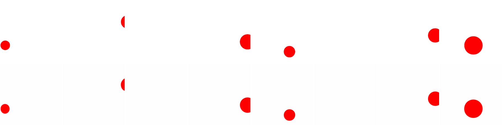 |  |  |  |
| **1** |  |  |  |  |
| **3** | 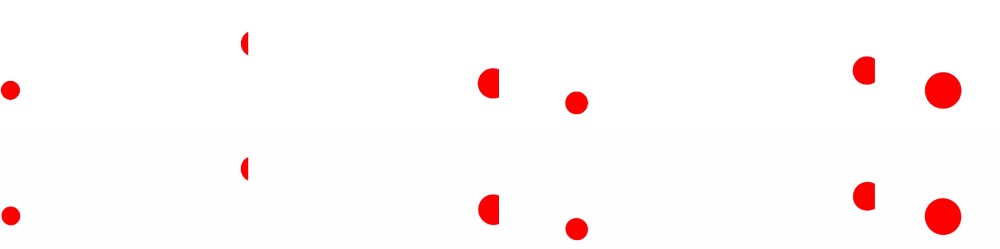 | 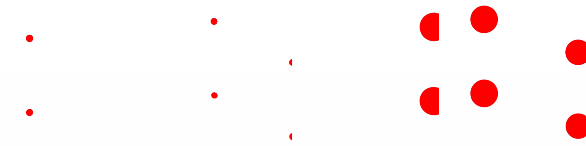 |  | 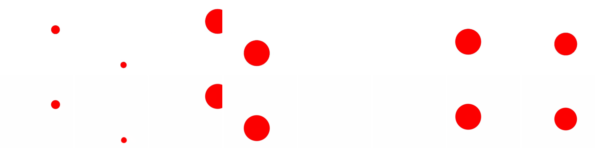 |
| **10** |  | 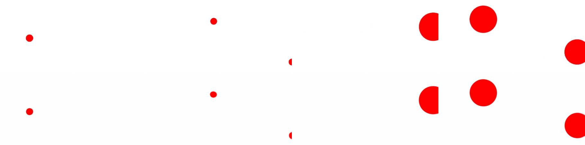 | 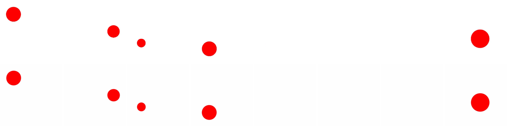 | 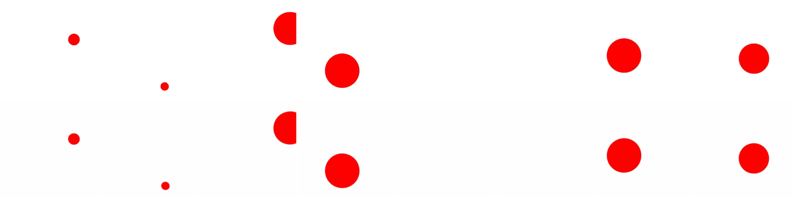 |

> 这 16 张是静态重建（阶梯①）：视觉上 λ 之间看不出差别。**别再从这里读"哪个 λ 的 world model 好"——那要看阶梯④的像素 rollout。**

#### 5.4.2 单轨迹 rollout 可视化：预测帧 vs 真实帧（漂移看得见）⭐

阶梯④只给了 PSNR 数字。下图把它**画出来**：取单条 ID 轨迹（episode 66，速度最大、球末端仍在画面内），让 predictor 用真 action 自回归滚动，在不同 horizon（预测步数）解码出帧。三行：

- **GT** = 真实未来帧
- **ceil** = 解码"真实 latent"（decoder 天花板，隔离 decoder 自身能力）
- **pred** = 解码"predictor 预测的 latent"（world model 真·预测）

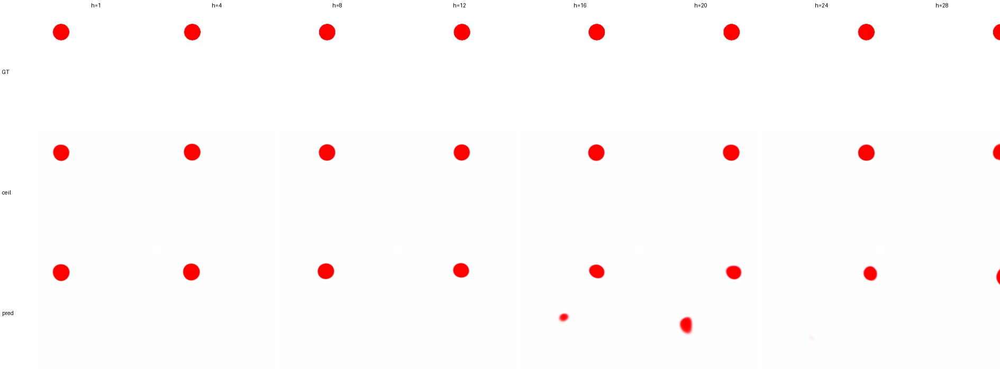

（encoder = pos-only **λ=1** 微调版；proj 空间通用 decoder）

**怎么读：**
- **h=1~12**：pred 行的球清晰、和 GT 基本重合 → 短程预测准。
- **h≥16**：pred 行的球开始**发糊、出现错位虚影**；**h=24/28 褪成一团淡影** → 这就是 predictor 多步滚动的**累积漂移**。
- **关键对照**：`ceil` 行**全程清晰**，而 `pred` 行末端糊掉 → 末端的差距是**预测漂移**造成的，**不是 decoder 读不出来**（两行用的是同一个 decoder）。

这正是阶梯④"PRED PSNR 随 horizon 24→20 dB、ceiling 一直 ~36 dB"那组数字的视觉版：**latent 里信息一直在（ceil 清晰），但 predictor 滚远了就对不准（pred 糊）**。脚本 [rollout_pixel_grid.py](../../../phyworld/scripts/rollout_pixel_grid.py)，换 `--ckpt`/`--decoder` 即可出其它 λ 或域的同款图。

---

## 6. 待办 / 下一步

- [x] 单 encoder 基础可视化（§3）——pusht latent 已编码位置，34.85 dB
- [x] **微调 vs 未微调 OOD 泛化（通用 decoder）**——§5：微调**没丢 OOD 信息**（OOD 球大小能重建）；decoder PSNR 上 pos-only > paperinit > pusht（但 PSNR 是循环指标，见 §5.4）
- [x] **λ sweep——四指标阶梯**（§5.4）：decoder PSNR（对偶）、裸 pred_loss（尺度）、rollout nMSE（latent 几何）三个 latent 指标各踩不同陷阱、给三种答案；**像素 rollout PRED PSNR（模型无关）决定性 settle：大 λ 不伤 world model，λ 对动力学质量基本中性，取 λ∈[0.3,1] 即可**。"+46% pred_loss 越大越差"被证伪为尺度假象
- [x] **OOD 分区 K 步 rollout**（§5.4 阶梯③④）——latent nMSE/cos + 像素 PRED PSNR，h→28，λ=10 不差反略好
- [x] **接 ARPredictor 滚动**（§5.4 阶梯④）：latent 滚 K 步→解码预测帧→vs 真实帧 PSNR（[rollout_pixel_eval.py](../../../phyworld/scripts/rollout_pixel_eval.py)）
- [ ] 扩到 parabola / collision（更复杂物理，看 λ 中性结论是否一致）
