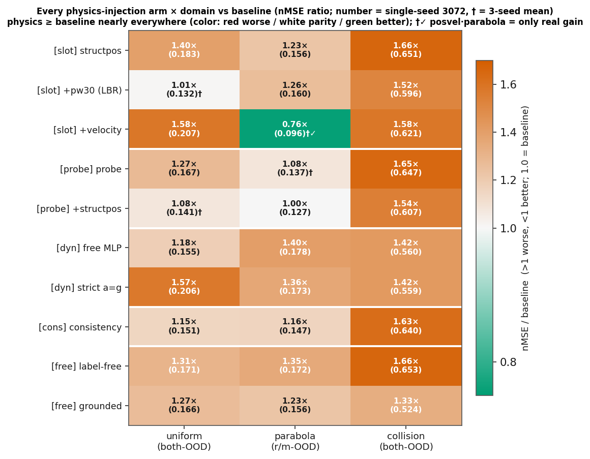
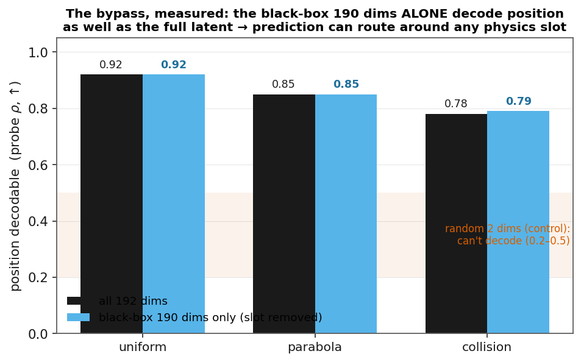

# 论文故事线 —— Toward Physics-Consistent Latent World Models: Why Injecting Physics Doesn't Help, and What Does

**对应稿件**:[paper/main.pdf](paper/main.pdf)(AAAI-27,正文 6 页 + 附录,已编译)
**日期**:2026-07-12
**用途**:讲给导师/合作者、写 rebuttal、检验叙事是否闭环时随时调。

---

## 一句话主线

直接对应标题两半(*Why Doesn't* / *What Does*),也是全文唯一的机制表述:

> **Why injecting physics doesn't help**:latent **已经**把物理**状态**编强了——位置 probe ρ **0.80–0.96**(三域 both-OOD),且**冗余分布在黑盒 190 维**(probe-190 三域实证)。再往共享 latent 注入**同一份状态**只是塞冗余:**不带新信号 → 不提升**;**还占表示容量、分梯度、与预测目标打架 → 有害**;而预测大可绕过物理 slot、直接走黑盒那份(***not load-bearing***)。
>
> **What does help**:真正的短板**不在"状态",而在预测器的长程 rollout 动力学**(状态可解码、但一自回归就漂)。修它靠**训练协议**——free-rollout 让预测器在训练时暴露于**自身累积误差**、学会纠偏(修 exposure bias)。它**不灌任何物理先验、不碰 latent 结构**,却比一切物理结构注入都管用。

**核心概念**:***decodable but not load-bearing***(存在 ≠ 使用,presence ≠ use)——decodable = 信息在场,load-bearing = 预测真的靠它。全文发现都挂在这个落差上。

**为什么这版表述值钱**(2026-07-13 收敛):① 它把"注入物理没用"和"修训练协议有用"**统一进同一个机制**(补 latent **已有的** vs 补 latent **真缺的**),不是两个孤立结论;② 它**免疫"换更高维 slot / 更好映射会不会好"的质疑**——那还是塞冗余状态、没堵旁路;要突破须**改架构堵旁路(extrinsic)**,不是换编码。详见 [detail/why_physics_structure_fails.md 层3](detail/why_physics_structure_fails.md)。

**三个不能混的精度点**(照这个对偶写作时必守,否则被审稿人捅穿):
1. **free-rollout 不是"注入物理演化规则",它啥物理都不灌**——"学到演化"是效果、不是手段;手段是改采样协议消 exposure bias。what-helps 我们证明的是**训练协议**这个杠杆,不是"注入动力学"这种物理结构。
2. 物理注入**不是"作用不大",是系统性有害**(30 格 25 格变差、29/30 不优于 baseline、从头共训 Δ+0.558)——反直觉点就在"有害",别软化。
3. 我们**否定的是注入"latent 已有的状态"**,不是所有物理注入;注入 latent **真缺的东西**(动力学/守恒量)或走 **extrinsic 架构**是**未证实的**开放出路(唯一疑似正例 parabola 速度 −0.026,不倚重,future work)。

---

## 逻辑链(每一步承接上一步)

1. **现象**:**未注入任何物理**的 JEPA 世界模型,编码器本身就把位置编进了 latent——真实帧 probe 可解码 ρ(pos 两维,baseline REAL-emb,**判读取方差最大、样本最多的 both-OOD 分区**):uniform **0.86–0.96**、parabola 0.83–0.89、collision 0.80–0.89;单步预测也近乎完美(latent cos 0.98–0.99)。(全 4 分区全距 **0.48–0.98**;低端几格——uniform v-OOD 0.826、collision v-OOD 0.482——是 **range restriction** 造成的统计假象:该维真值方差恰是全表最小档、而 Pearson ρ 分母含真值 std,`check_pos_variance` 实测坐实;非"信息缺失",逐格表 + 方差实证见 [detail/why_physics_structure_fails.md 层0](detail/why_physics_structure_fails.md))但一自回归 rollout 就崩(latent collision h28 cos 掉到 **0.24**、OOD 更崩),而位置信息仍留在真实表示里(collision both-OOD REAL-emb ρ≈0.84,两维均)。→ **状态可解码,不代表物理可遵守。**(出处 `aaai_p0/rollout_{域}_baseline_fr_s1234.log` 的 `probe applied to REAL embs` 段)

   

   > **Fig 1 读图**(collision 域):横轴 = rollout 步数,纵轴 = 与真实的吻合度(0–1)。**绿虚线** = 从真实帧 latent 线性解出位置的 ρ≈0.84(位置一直在 latent 里、平线);**红线**(teacher-forced 原始训练)单步 0.99 → h28 **崩到 0.24**;**蓝线**(free-rollout)长程稳住 0.48。→ **信息在场 ≠ 预测用它(presence ≠ use)**,修它靠换训练协议(红→蓝)、不靠注入物理。

2. **现状**:针对OOD和长程预测不准，学界两条药方——① 注入物理结构(PIWM / 深监督);② 堆数据(PhyWorld 已证 video 生成这条不行)。**但"物理结构能不能救 latent 世界模型"从没被系统测过。**

3. **缺口(真正的那个)**:物理结构的注入方式、初始化、物理域都是**零散、各测各的**,**从没和"训练协议"这个最大混淆变量做过受控析因对比**——大家默认"训练那些是背景、物理结构是变量",却没人在同一 baseline 上把两者摆到一起比。→ **一个基本的析因问题没人回答:把训练协议先做对(free-rollout)之后,物理结构还有增量价值吗?**
   - (**附带的方法论隐患**,当独立贡献不当主缺口):cos/probe 这类指标是**训练目标的对偶量**、加了对应 loss 必然涨,容易制造"物理有效"的假象——**我们自己早期 sweep 就被 K=4 ρ 带偏**、得"λ=50 胜出"、改用 pred_loss 后翻案。⚠️ **不宣称"前人都建在 cos/probe 上"**(deep-sup 2504.03861 恰用了可信的 pred_loss、结论也对);此隐患是"判决指标须用 nMSE/pixel"的普适警示,不是"别人指标错了"的指控。)

4. **我们的做法**:一次把设计空间扫满——**5 个注入机制家族(含变体共 10 臂;10 臂 × 3 域 = 步5 的 30 格)× 2 种训练方案 × 3 个物理域 × 2 个照片级仿真基准**,种子受控,**~200 个训练 run**(实数 199 个训练日志:structdyn 118/aaai_p0 29/physionpp 31/pretrain 12/rerun 9;旧文 ">60" 系低估)。(5 家族 10 臂具体是啥、30 格全表 + 热力图 → [detail/physics_injection_full_scan.md](detail/physics_injection_full_scan.md))

5. **发现一(负,论文主体)**:**物理结构不是通用杠杆**。把各种物理量(位置/速度/加速度)固定编码进 slot,30 个"机制×域"格子里**对整体数据几乎都是损害或持平**(25 格明确变差、4 格持平、仅 1 格真小赢 → **29/30 不优于 baseline**;全表+热力图见 [detail/physics_injection_full_scan.md](detail/physics_injection_full_scan.md));唯一例外是 parabola 上把速度也编进 slot 有**一点点**提升(r/m 0.122→0.096,量级很小),**可能**因为速度在抛体里是随时间线性变化的驱动量、比二次位置好外推——但这点小提升不构成可用方法(同一编码在 uniform/collision 上反而变差 +0.071/+0.142)。从头共训比后训练嫁接**伤得更狠**(uniform Δ 从 +0.035 放大到 +0.558),堵死"要在预训练注入才行"的辩护。**一条独立于 nMSE 的旁证**:phyworld→Physion 的 zero-shot 迁移上,**物理结构(pos_weight)0.551 是全部配置里最差的**、比 free-rollout(0.603)还低,连 random 架构先验(0.607)都够不着——**换个数据集、换个指标(AUC)、换个任务(迁移),"物理结构越强越差"依然成立**(逐配置数据 → [detail/real_data_physion.md](detail/real_data_physion.md))。

   

   > **Fig 16 读图**:10 行 = 10 个注入臂(按 5 家族分组:`[slot]`固定编码/`[probe]`深监督/`[dyn]`运动学头/`[cons]`一致性/`[free]`无标签);3 列 = 三域判决分区。每格 = **nMSE/baseline 倍数**(括号内原始 nMSE);**颜色 = 判决:红更差、白持平、绿更好**;`†` = 三种子均值(其余单种子),`✓` = 唯一真提升。→ **几乎全红**;整列 collision(1.33–1.66×)最狠;30 格 **25 差 / 4 平 / 仅 posvel·parabola 0.76× 真降 = 29/30 不优于 baseline**。

6. **机制(回答"为什么全废")**:**物理 slot 占比低、被预测绕过(load-bearing problem)**([论据详见 detail/load_bearing_reweighting.md](detail/load_bearing_reweighting.md))——物理 slot 只占 2/192 维、~1% 梯度,黑盒 190 维还冗余编码了位置,预测绕开 slot 走黑盒;物理梯度和预测梯度打架(比值 15–125×)。**可证伪验证(LBR 全曲线消融,pw1→300)**:加权到头,4 个域×分区只有 2 个救回持平(uniform·both、parabola 高权 r/m),uniform·r/m 和 collision 全程救不回、collision 还越加越差——**加权只在 slot 占主导那格消掉危害,多数格子仍有害、无净增益**,证明了机制方向对但修不了根本(旁路在)。**这一步把"负结果"变成"有机制解释的科学发现"。**

   

   > **Fig 15 读图**(旁路的直接实证):三个域,每域两根柱——**黑柱 = 用全部 192 维解位置**、**蓝柱 = 去掉物理 slot、只用黑盒 190 维解位置**(probe ρ↑)。两柱几乎等高(0.78–0.92)= **黑盒单独就把位置编了进去**;底部红带 = 随机 2 维对照(0.2–0.5,解不出)。→ **位置冗余铺在黑盒里,预测可绕过任何物理 slot**。

   

   > **Fig 8 读图**(承重加权 LBR 的边界):左 = uniform 上 pos_weight 1→300 的曲线(蓝 both-OOD / 橙 r/m-OOD,虚线带 = 各自 baseline);右 = 三域 nMSE/baseline 比值随 pos_weight。→ 加权只把 **uniform·both 拉回持平**(r/m 全程救不回)、**collision 任何权重都在 baseline 之上且越加越差**。→ 承重是**机制验证**(方向对)、**不是修复方法**(2/4 判决格持平、从不净增益)。

7. **发现二(正,支配变量)**:真正**跨域不翻车**的杠杆**不在结构侧、而在训练协议侧**,有两个:① **free-rollout**——只翻一个开关、不灌任何物理,uniform/parabola/collision **2.2–3.6×** + 真实 Physion++ **8.3×**,**唯一跨合成/仿真都通用的主升力**(论据 [detail/free_rollout_evidence.md](detail/free_rollout_evidence.md));② **rollout horizon 匹配动力学复杂度**——碰撞吃长 rollout、光滑域不吃;真实数据 np8→28 长程 nMSE 单调降到 **1/19**、无拐点。→ 两者都**只动"怎么训"、不动"latent 里放什么"**,却双双碾压 30 格物理注入 → 正面落点 = **支配变量在训练协议**,而非负结果堆。

   

   > **Fig 2 读图**(① free-rollout):每域两根柱 = teacher-forced vs free-rollout 的 rollout 误差(nMSE↓),柱顶 = 下降倍数。**只翻一个开关、不灌任何物理**,合成三域 + 真实全部大降,**真实数据反而更猛**:
   >
   > | 域 | TF | FR | 倍数 |
   > |---|---|---|---|
   > | uniform | 0.300 | 0.136 | 2.2× |
   > | parabola(r/m) | 0.443 | 0.122 | 3.6× |
   > | collision | 1.153 | 0.479 | 2.4× |
   > | **Physion++(真实,h64)** | 1.174 | 0.141 | **8.3×** |

   

   > **Fig 7 读图**(② horizon 匹配动力学):Physion++ 直训,不同 num_preds 配置的 **by-horizon nMSE(log 轴,↓)**。np8 → np20 → np20+scale → **np28+scale**,长程单调下降、**h64 从 0.280 打到 0.014(1/19)、未见拐点**。→ 真实动力学比合成域**更吃长 rollout**。

8. **发现三(方法论):判决指标不能用 cos/probe**——它们是**训练目标的对偶量**:加了对应 loss 必然涨,而**涨的是"信息在不在 / 方向对不对",不是"预测对不对"**。当主指标会**系统性高估物理结构**(实测多处反转:cos 升 1.50× 而真值 nMSE 崩到 0.21;我们自己早期 sweep 盯 K=4 ρ 得"λ=50 胜出",改用 pred_loss 后翻案)。**但没有单一完美指标**:nMSE 带尺度、方向偏和幅度偏都罚,可它**分母是真值方差 → 方差→0 时除零引爆**(parabola 长 horizon 飙到 197 万,故该域判决改走 r/m-OOD)——**方向恰与 cos 陷阱相反:cos 尺度盲会漏报、nMSE 分母退化会虚报**,这正是必须交叉验证的理由。**pixel PSNR 是最难作弊的锚**(端到端逐像素,改 latent 分布骗不过去),而 **nMSE 的可信度正来自它与 pixel 始终同向**——所有反转案例里,分歧的都是 cos vs (nMSE/pixel)。→ **判决 = nMSE + pixel 为主、cos/probe 只当诊断、逐分区逐 horizon 交叉验证。**(不宣称文献比例;deep-sup 2504.03861 本身用可信指标 pred_loss、结论正确,其 recipe 在我们高维视觉 latent 失效属塌方机制、非指标问题。四把尺子优劣对照表 + 两条判据 + 逐案例数据 → [detail/evaluation_traps.md](detail/evaluation_traps.md))

   

   > **Fig 5 读图**(cos 陷阱):三个真实案例,每个两根柱——**蓝 = cos 指标怎么说、红 = 真值指标(pixel/nMSE)怎么说**(相对 baseline 的"好坏比值",>1 更好,log 轴)。**每例都是蓝在 1.0 上(cos 说变好)、红在 1.0 下(真值说变差)** → 只看 cos 会得出**相反**结论;判决必须用 nMSE/pixel、cos 只当诊断。

9. **结论(建设性,不自我否定)**:我们没否定物理结构本身,只否定"往共享 latent 上**嫁接**"。**extrinsic 架构**(低维物理态是预测唯一必经通道)才让预测天然依赖物理态——**我们把官方 PIWM 忠实移植到 phyworld 验证了这点:它学到正确物理、ID/v-OOD 比 LeWM 还准,但 size/mass-OOD 崩(ρ 0.33 vs 0.89)——PIWM 的红利来自它的架构而非方程,而其 VAE 编码器同样扛不住 OOD**。这既解释了别人的正结果、又和我们的负结果自洽,还指出了唯一出路(future work)。(论据 [piwm_baseline/PLAN.md](../piwm_baseline/PLAN.md))

   

   > **Fig 9 读图**:官方 PIWM(紫,extrinsic 架构)vs LeWM free-rollout(蓝)的 rolled-out 位置 ρ(↑),分 4 个 OOD 分区。**PIWM 学到正确物理、ID/v-OOD 甚至更准,但阴影的 size/mass-OOD 崩**(VAE 编码器扛不住没见过的球尺寸):
   >
   > | 分区 | PIWM | LeWM |
   > |---|---|---|
   > | ID | **0.96** | 0.93 |
   > | **r/m-OOD** | 0.33 ⚠️ | **0.89** |
   > | v-OOD | **0.97** | 0.87 |
   > | **both-OOD** | 0.48 ⚠️ | **0.87** |
   >
   > → extrinsic 解决了"承重/旁路",但**没解决"编码器扛不住 OOD"**——是必要条件、非充分条件。

---

## 三个发现如何互锁(故事的精髓)

不是三块拼盘,是**一个论证**:

- 发现一说"结构没用" → 立刻有人问"是不是你实现有 bug / 指标不对"
- 发现二(训练协议大赢)证明**同一套代码、同一批指标下别的干预能大幅提升** → 排除"实现/指标失效",反衬出是结构本身没用
- 发现三(评测陷阱)解释**为什么别人以为结构有用** → 补上"那前人的正结果哪来的"这个缺口
- 机制(占比低+被旁路绕过)+ LBR 验证把这三者**统一**到一个可证伪的解释下

关于 parabola 那点小提升(−0.026 nMSE):**不当卖点、不当证据支柱**。它量级很小、只在一个域一个分区出现、可能含随机成分——诚实说法就是"物理量进 slot 整体有害,parabola 偶尔小赢一点,可能因速度在抛体里可外推"。反驳"实现有 bug"不靠它(靠 probe-190 旁路 + structured_loss 降 + slot 可解码涨 + 梯度打架 + free-rollout 阳性对照,见下)。

### 最致命的质疑:"发现一结构没用是不是你实现有 bug"

负结果最容易被这样打发——"你物理 loss 没真接进去,所以才看不出效果"。反驳的关键是**不辩"检查过代码"(苍白),而用模型的可观测行为证明约束真生效了**,只是生效方向无益/有害(①bug 没接上→和 baseline 无异;②真生效→被改变但方向有害;证据全指向②)。行为证据 + free-rollout 阳性对照:structured_loss 在降、slot 可解码性大涨、**probe-190 实测黑盒旁路存在**、按 pos_weight 甜点系统响应、梯度层面与预测拔河、危害随强度单调。

> 六证据的**逐条数字、剂量-反应曲线、"编码方式次优"升级质疑的反驳**(全带数据与出处)→ **[detail/why_physics_structure_fails.md](detail/why_physics_structure_fails.md)**。

---

## 配图速查（做 PPT 用）

**8 张图已内嵌在上方逻辑链对应步骤里**（点开即见，无需跳转）。这里只列取图索引：矢量 `.pdf`（插 PPT 用这个）在 [figures/](figures/)，脚本 [figures/storyline_figures.py](figures/storyline_figures.py) 一键重画，每张图的**数据表 + 原始数据源**见 [detail/figures_gallery.md](detail/figures_gallery.md)。

> **时间紧只讲 3 张**：**Fig 1**（钩子：可解码≠预测用它）→ **Fig 16**（物理注入 30 格全废，主体）→ **Fig 2**（训练协议才是杠杆，正面落点）。

| 图 | 讲什么 | 在哪一步 | 文件 |
|---|---|---|---|
| **Fig 1** | 可解码 ≠ 预测依赖它（钩子） | 步1 | `fig1_thesis_presence_not_use.pdf` |
| **Fig 16** | 物理注入 30 格全扫，29/30 不优于 baseline | 步5 | `fig16_physics_injection_scan.pdf` |
| **Fig 15** | 旁路实证：位置冗余在黑盒 190 维里 | 步6 | `fig15_bypass_probe190.pdf` |
| **Fig 8** | LBR 边界条件（机制的可证伪验证） | 步6 | `fig8_lbr_ablation.pdf` |
| **Fig 2** | free-rollout 跨域通用 2.2–8.3×（正面地基） | 步7① | `fig2_free_rollout.pdf` |
| **Fig 7** | 真实数据长 rollout 单调好、无拐点 | 步7② | `fig7_realdata_num_preds.pdf` |
| **Fig 5** | cos 陷阱（方法论） | 步8 | `fig5_cos_trap.pdf` |
| **Fig 9** | PIWM 外部 baseline 也崩 OOD | 步9 | `fig9_piwm_vs_lewm.pdf` |

## 每节在故事里的角色

| 节 | 角色 |
|---|---|
| Intro | 抛出"可解码≠遵守" + 缺口(析因没人做) |
| Related | 定位三条线(基准 / 物理结构 / exposure bias),点名将被检验的对象 |
| Setup | 交代受控实验设计(为什么 1K、为什么单机制、指标为什么用 nMSE/pixel) |
| §4 物理失效(心脏) | 发现一 + 机制(占比低+被旁路绕过) + LBR 可证伪验证 |
| §5 什么有效 | 发现二(支配变量在训练协议:free-rollout + horizon 匹配) |
| §6 评测方法论 | 发现三(判决指标为什么必须是 nMSE/pixel、cos/probe 只当诊断) |
| §7 结论 | 归因架构、指出 extrinsic 出路、诚实 limitation |

---

## 为什么这个故事能投 AAAI

不靠"新方法"(free-rollout = Scheduled Sampling,本就不新),靠**一个反直觉、有机制、跨机制×域×数据集系统验证的科学发现**:

> *物理归纳偏置在共享 latent 世界模型上系统性失效,因为信息可解码但预测不依赖它;真正的杠杆在训练协议。*

加上评测方法论(cos 陷阱)和对 PIWM 的架构性归因,这是一篇诚实、完整、有解释力的实证论文——审稿人挑不出"证据不足"或"叙事不闭环"。详细创新性评估与审稿人反对意见预案见 [02_story_and_novelty.md](02_story_and_novelty.md);数字总账见 [01_results_ledger.md](01_results_ledger.md)。
