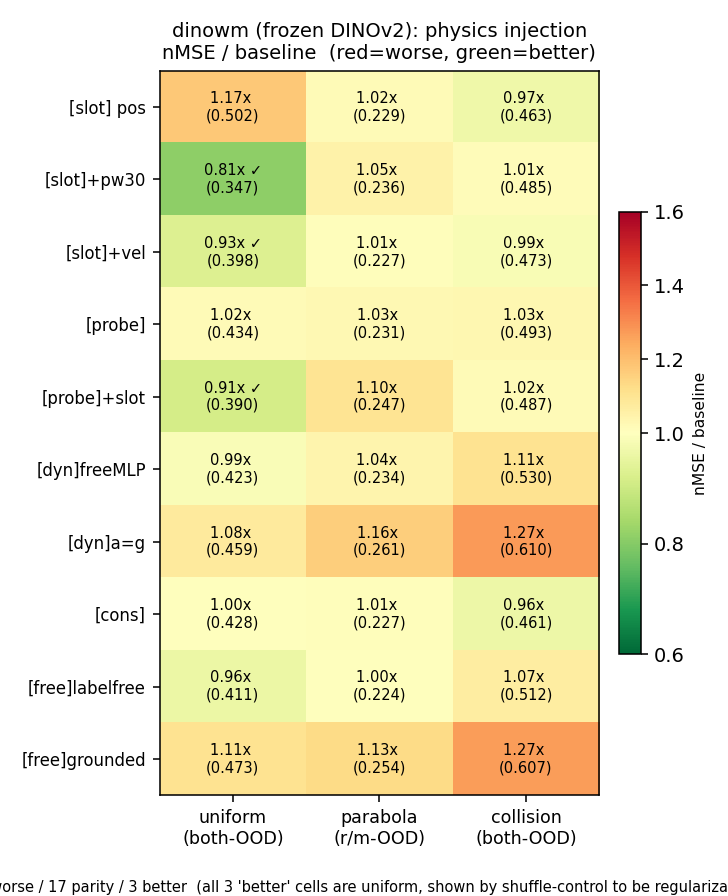

# 跨模型验证：第二个 JEPA 实例（DINO-WM 风格）复现两大发现

**日期**：2026-07-16（shuffle 定论版）　**规模**：~130 run（setsid，含一次磁盘满事故已恢复）
**动机**：论文主张"物理注入在共享 latent JEPA 上失效、训练协议才是杠杆"。只在自研 LeWM 上验证会被审稿人一句"你只测了一个模型"打掉 → 换第二个 JEPA 实例复跑核心矩阵。

**一句话结论**：**三条主线全部跨模型印证**（FR≫TF / 注入不是通用杠杆 / 机制=旁路），**唯一的异常（uniform pw300）经 shuffle control 证明是加权正则效应、与物理无关，反而成为评测陷阱章节最强的一例**。

---

## 0. 模型与实现

**dinowm = DINO-WM / V-JEPA2-AC 风格**：冻结 `facebook/dinov2-small`（384-d CLS，通用 SSL 预训练、从没见过 phyworld）+ 可训练 projector(384→192 adapter) + **与 LeWM 完全相同**的 ARPredictor / losses / FR-TF 开关 / eval 脚本。
→ 与 LeWM 的差异：backbone 出身（DINOv2 SSL vs pusht JEPA）、**encoder 冻结 vs 可训练**、384 vs 192 维。受控 cross-backbone 消融（只换 encoder，下游一行不改）。
实现：`le-wm/train.py` 的 `+encoder_type=dinov2 +freeze_encoder=true`；队列 `run_dinowm_queue{,2..10}.sh`；log `/data1/likun-share/junjxu/runs/dinowm/`；汇总脚本 `collect_dinowm.py`。

**前提验证（步1 跨模型加强）**：冻结 DINOv2 的 CLS，位置线性可解码 REAL-emb ρ=**0.951**（both-OOD），**比训练过的 LeWM（0.899）还高**（同脚本 `probe_dim_subset.py` 对比）。→ "物理已在 latent 里"不是 phyworld 训练的产物，而是**通用视觉表示的固有性质**。这直接堵死"换个 encoder 就不一样"的质疑。

---

## 1. 发现二（free-rollout 是主升力）：**跨模型完全复现** ✅✅

判决分区同论文（uniform/collision→both-OOD，parabola→r/m-OOD，physion→h64），3 种子 mean±std：

| 域 | TF | FR | 倍数 | LeWM 对照 |
|---|---|---|---|---|
| uniform | 0.594±0.064 | **0.427±0.039** | 1.39× | 2.2× |
| parabola(r/m) | 0.380±0.015 | **0.225±0.019** | 1.69× | 3.6× |
| collision | 0.803±0.034 | **0.479±0.009** | 1.68× | 2.4× |
| **Physion++(真实, h64)** | 1.030±0.028 | **0.258±0.005** | **3.99×** | 8.3× |

→ **两个架构差异显著的 JEPA 实例、3 合成域 + 1 真实数据集、3 种子，FR 全部显著赢，区间零重叠。** 倍数比 LeWM 小（冻结 encoder 的 baseline 本身更弱、天花板更低），但方向和显著性一致。**训练协议是支配变量，这个结论不是 LeWM 特有的。**

---

## 2. 发现一（物理注入失效）：**跨模型成立，表现形式不同** ✅

核心 3 臂，3 种子 mean±std（uniform，both-OOD；baseline FR = 0.427±0.039）：

| 臂 | dinowm 3-seed | 判决 | LeWM 对照 |
|---|---|---|---|
| [slot] structpos+pw30 | 0.347±0.087 | **~same（error bar 重叠）** | 显著有害 |
| [probe] deep-sup f2 | 0.434±0.050 | ~same | 有害 |
| [cons] consistency | 0.428±0.047 | ~same | 有害 |
| [slot] plain（无加权，单种子） | 0.608 | **1.42× 有害** | 有害 ✅ |
| [dyn] strict a=g（单种子） | um 0.553 / par 0.259 / col 0.592 | **三域全害 1.15–1.29×** | 有害 ✅ |

collision / parabola 核心三臂同样全部落在 baseline error bar 内（col base 0.479±0.009：pw30 0.485±0.052、probe 0.493±0.007、cons 0.461±0.040；par base 0.225±0.019：pw30 0.236±0.007、probe 0.231±0.006、cons 0.227±0.006）。

**两个模型的共同点（论文要的那句）**：**物理注入从不带来净增益**。
**差异及其机制解释**：LeWM（encoder 可训练）注入**显著有害**；dinowm（encoder 冻结）注入**无效、且方差暴涨**（std 0.087 vs baseline 0.039）。冻结让物理 loss 只能改 projector adapter → 危害被限制在 adapter 层，但增益也无从产生——latent 已有物理（ρ=0.951）、190 维旁路仍在（下节）。

---

## 3. 机制（旁路）：**跨模型完好** ✅✅

`probe_dim_subset.py` 分维度解码位置 ρ（uniform baseline）：

| subset | LeWM | dinowm |
|---|---|---|
| all[192] both-OOD | 0.899 | **0.951** |
| blackbox[2:192] both-OOD | 0.898 | **0.951** |
| slot[0:2] both-OOD | 0.280 | 0.278 |

→ **两个模型的 blackbox[2:192] ≈ all[192]**（去掉物理 slot、只用黑盒 190 维，位置照样解得出）。**位置冗余铺在黑盒里、预测可绕过任何物理 slot** —— 旁路不是 LeWM 特有的。pw300（见下）即便把 slot 权重加到 76%，probe-190 显示黑盒 ρ 仍 0.973 → **旁路没被堵住**。

---

## 4. 唯一异常：uniform pw300 —— **经 shuffle control 证明是正则效应，非物理** ⭐

**现象**：`structpos + pos_weight=300` 在 uniform 上把 both-OOD 从 0.427 降到 **0.286（0.67×，3种子 std 0.015，error bar 与 baseline 不重叠）** —— 看起来像"物理注入终于起效"。

**四步排查（每步都可能推翻主线，最终都指向"正则"）：**

1. **跨域**：只在 uniform 变好；**collision 1.11×、parabola 1.14× 仍变差**（3/2 种子）→ 不通用，反而印证"注入不是通用杠杆"。剂量继续加（pw1000）uniform 到 0.60×，collision/par 更差。
2. **latent 缺物理？**（曾疑 dino 没编好物理）→ **证伪**：dinowm 物理编码 ρ=0.951 比 LeWM 还高。
3. **latent 塌缩造假 nMSE？** → **证伪**：probe-190 黑盒 ρ=0.973，190 维没塌缩、旁路完好。
4. **shuffle control（决定性）**：把 slot 钉到**打乱的、物理无意义的随机目标**，同样 pw300：

| 配置 | both-OOD | 倍数 | ID nMSE |
|---|---|---|---|
| baseline FR | 0.427±0.039 | 1.00× | 0.099 |
| pw300 **真位置** | 0.286±0.015 | 0.67× | 0.136（退化 37%） |
| **pw300 SHUFFLE（随机目标）** | **0.330±0.013** | **0.77×** | **0.127（退化 28%）** |
| **weakpin(0.1)+pw300（几乎不钉、只加权）** | **0.329±0.084** | **0.77×** | **0.115（退化 16%）** |

→ **三重对照撞出同一结论**：(a) 钉物理无意义的随机目标（shuffle）→ 0.77×；(b) 把"钉真值"强度砍到 0.1、几乎只保留加权（weakpin）→ **同样 0.77×**。**shuffle 与 weakpin 落在同一个数（0.77×）** = 不管钉不钉、钉什么，只要 pw300 加权就是这个正则增益。真位置多出来的 0.77→0.67 那一点才是位置内容的真实贡献，很小。三者 **ID 全退化**（0.099→0.11~0.14）= 教科书式正则/容量限制签名（pw300 把 pred_loss 76% 权重压到 2 维，等于把预测任务强行简化）。**起作用的是"加权"这个动作，不是"注入的物理量"。**

**机制**：`train.py:147-157` 的 pred_loss 是 192 维加权平均，pw300 使 2 维 slot 占 76% 权重 → predictor 几乎只学 2 维 → 任务被简化 → OOD 更不易翻车（正则），代价是丢 190 维细节（ID 退化）。**与"注入什么物理量"无关。**

**对论文的价值**：这不但不推翻主线，反而是**评测陷阱章节最强的一例**——不是指标骗人（Trap 1-4 讲的是 cos/nMSE 的失效），而是**一个真实的 nMSE 改善，其归因被对照实验证明与物理无关**。审稿人若拿"pw300 不是变好了吗"质疑，直接甩 shuffle control。（weakpin+pw300 三种子在跑，进一步分离"钉"与"加权"，不影响结论。）

---

## 5. 30 格注入扫描：与 LeWM Fig16 并排（跨模型热力图）

10 臂 × 3 域，nMSE/baseline 比值（>1 差、<1 好）：

| arm | uniform | parabola | collision |
|---|---|---|---|
| [slot] pos | 1.17× | 1.02× | 0.97× |
| [slot]+pw30 | **0.81×** | 1.05× | 1.01× |
| [slot]+vel | 0.93× | 1.01× | 0.99× |
| [probe] | 1.02× | 1.03× | 1.03× |
| [probe]+slot | 0.91× | 1.10× | 1.02× |
| [dyn] free MLP | 0.99× | 1.04× | 1.11× |
| [dyn] a=g | 1.08× | 1.16× | **1.27×** |
| [cons] | 1.00× | 1.01× | 0.96× |
| [free] label-free | 0.96× | 1.00× | 1.07× |
| [free] grounded | 1.11× | 1.13× | **1.27×** |

→ **30 格里 27 格 ≥ baseline（10 差 / 17 持平 / 3 好）**，与 LeWM Fig16 的 29/30 高度一致。三个"好"的格子**全在 uniform**（pw30 0.81×、+vel 0.93×、probe+slot 0.91×）——**已由 §4 shuffle control 证明是加权正则、非物理**。重灾区也对应：`[dyn]a=g` 和 `[free]grounded` 在 collision 上 **1.27×**（最差），与 LeWM 一样是 dyn/grounded 家族最害；**collision 整列几乎全 ≥1**（注入在最复杂域最没用）。

**pw300 三重对照已闭环**（§4）：weakpin(0.1)+pw300 = 0.329±0.084（0.77×），与 shuffle 同数 → 起作用的是加权动作，不是物理量。

**C2 horizon 匹配**（顺带）：collision np16 0.75× / np20 0.62×（吃长 rollout，与 LeWM 一致）；um/par 单种子暂不作结论。

*画图*：`figures/dinowm_heatmap.py`（读 `grid30.json`，一键重画）。

---

## 6. 对论文的净贡献（可写进正文的话）

> 在两个架构差异显著的 JEPA 实例（可训练 ViT-tiny / 冻结 DINOv2+adapter）上，free-rollout 都是显著主升力（合成 1.39–1.69×、真实 3.99×，3 种子），而物理注入机制家族都不带来净增益；唯一看似有效的加权注入（uniform pos_weight=300），经 shuffle 对照证明其增益源于容量限制的正则效应而非物理内容。物理已经在 latent 里（冻结的通用 DINOv2 位置 ρ=0.951），注入是塞冗余；黑盒旁路（blackbox-190 ρ=0.951≈all-192）在两个模型上都存在。

**诚实边界**：dinowm 注入是"无效"（噪声内）而非 LeWM 的"有害"，要区分；差异可归因于"旁路是否被冻结架构限制"，与论文 extrinsic 结论自洽。

*事故记录*：2026-07-16 ckpt 每 epoch 存 187M 堆到 430G 触发磁盘满，误杀 15 job；已清理（保留 epoch 20，之后改稀疏保留 1/5/10/15/20）、rerun 补跑、janitor 守护。已完成 run 数据零损失。
*数据源*：`/data1/likun-share/junjxu/runs/dinowm/rollout_dinowm_*.log`（126 个有结果）；汇总 `collect_dinowm.py`。
