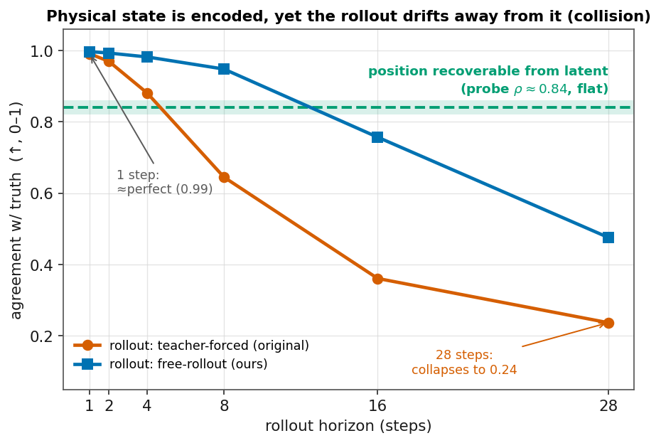
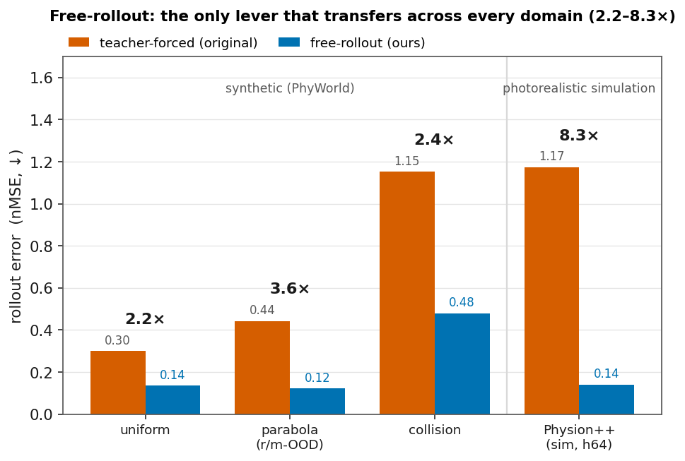
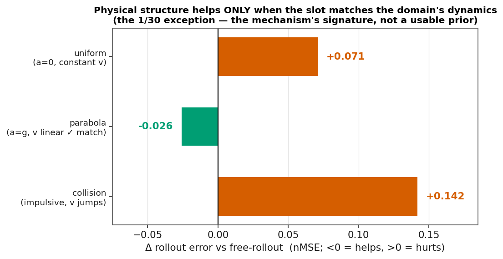
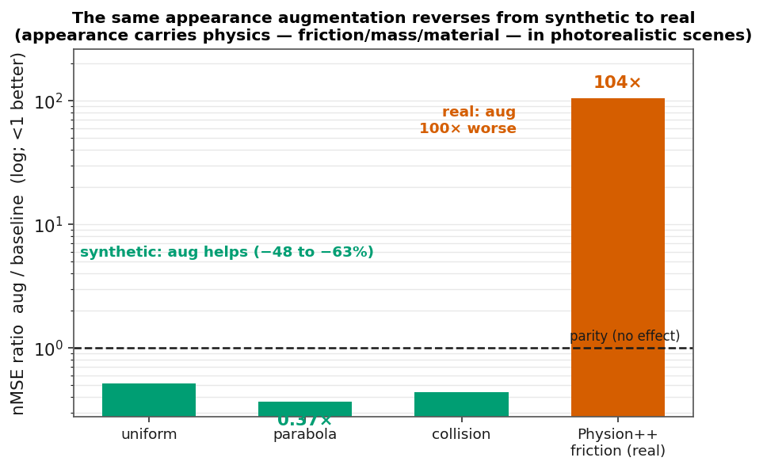
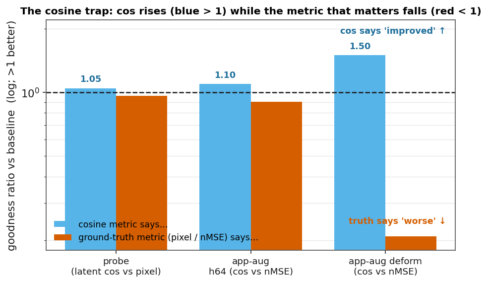
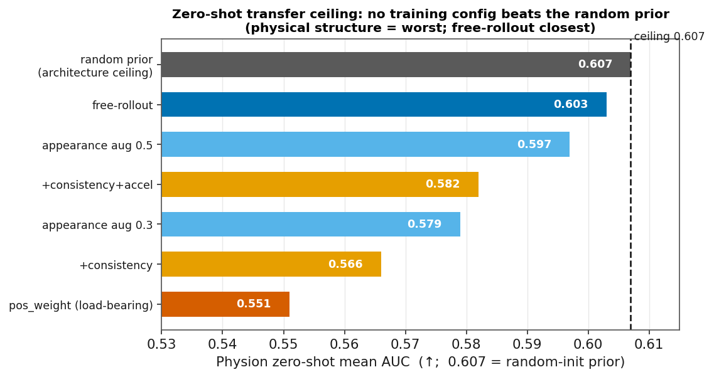
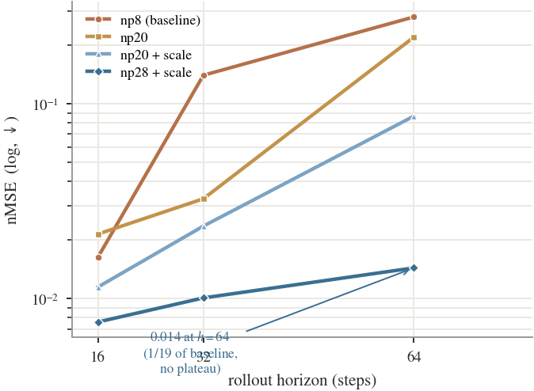
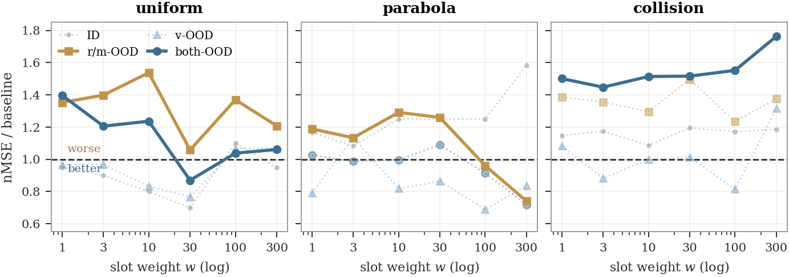
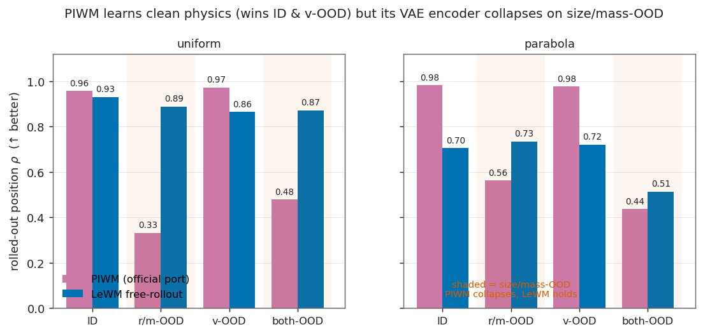

# 故事线配图库（PPT 用）

> # 🎯 一句话结论
> **故事线 9 张图的「一句话主旨(可直接当 slide 标题)+ 数据表 + 原始数据源」;时间紧只讲前 3 张(钩子 → 正面 free-rollout → 负面物理+机制)即可立住主线。**

**用途**:给导师汇报故事线的 9 张图,每张配「一句话主旨（可直接当 slide 标题）+ 数据表 + 原始数据源」。图文件在 [../figures/](../figures/)（`.png` 投影用、`.pdf` 矢量插 PPT 用），一键重画脚本 [../figures/storyline_figures.py](../figures/storyline_figures.py)（所有数字内嵌+源注释）。配色 Okabe-Ito（色盲安全）。

对应关系:图 → [06_storyline.md](../06_storyline.md) 逻辑步 → [01_results_ledger.md](../01_results_ledger.md) 主张。

---

## Fig 1 — 主论点:可解码 ≠ 预测依赖它 `fig1_thesis_presence_not_use`

> **状态一直可从 latent 解码出来（ρ≈0.84），但自回归 rollout 崩到 0.24——预测没在用它编码的物理。**

- 数据（collision,cos by horizon）:teacher-forced h1..h28 = 0.99/0.97/0.88/0.65/0.36/**0.24**;free-rollout = 0.997/0.99/0.98/0.95/0.76/**0.48**;可解码带 = both-OOD REAL-latent 位置 probe ρ≈0.84。
- 源:`/data1/likun-share/junjxu/runs/aaai_p0/rollout_collision_baseline_{tf,fr}_s{3072,1234,42}.log`（段 `--- ... vs horizon ---` 的 `cos=`;probe ρ 段 `REAL both-OOD`）。
- 支撑:storyline 第 1 步 / 主线一句话。

## Fig 2 — 发现二①:free-rollout 是唯一跨域通用主升力 `fig2_free_rollout`

> **只翻 teacher-forcing→free-rollout 一个开关,三合成域 + 真实仿真全大幅提升（2.2–8.3×）。**

- 数据（nMSE↓;parabola 用 r/m-OOD）:uniform TF 0.300→FR 0.136（2.2×）、parabola 0.443→0.122（3.6×）、collision 1.153→0.479（2.4×）、**Physion++ h64 1.174→0.141（8.3×,3 种子）**。
- 源:合成 `aaai_p0/rollout_{uniform,parabola,collision}_baseline_{tf,fr}_s*.log`;真实 `/data1/.../runs/physionpp/eval_pp_{tf,fr}_s{3072,1234,42}.log`。
- 支撑:第 7 步发现二① / C1;detail [free_rollout_evidence.md](free_rollout_evidence.md)。

## Fig 3 — 发现一+机制:物理结构只在"匹配动力学"时才帮 `fig3_physics_signflip`

> **把速度编进 pos_weight 加权 slot,只有 parabola（a=g、速度线性驱动）变好；uniform/collision 反而更差——1/30 例外正是机制的签名。**

- 数据（Δ nMSE vs free-rollout;<0 帮 >0 伤）:uniform +0.071、collision +0.142、parabola(r/m) **−0.026**（三种子确证）。
- 源:`aaai_p0/rollout_{uniform,parabola,collision}_structposvel_pw30*.log` vs `..._baseline_fr_*.log`。
- 支撑:第 5–6 步 / C4;detail [why_physics_structure_fails.md](why_physics_structure_fails.md)。

## Fig 4 — 发现二边界:同一增广,合成有效、真实反转 100× `fig4_aug_synthetic_vs_real`

> **appearance 增广在合成域降 48–63%,在照片级仿真上 nMSE 崩 100×——因为真实场景里外观携带物理（摩擦/质量/材质）。**

- 数据（nMSE 比值 aug/base,<1 更好）:uniform 0.52、parabola 0.37、collision 0.44;**Physion++ friction 6.44/0.062 = 104×**。
- 源:合成 [general_augmentation.md](../../6-24/final/general_augmentation.md);真实 `/data1/.../runs/physionpp/eval_pp_fr_e20.log`（base）/`eval_pp_fr_app05_e20.log`（app05）。
- 支撑:第 7 步增广警示 / C3;detail [augmentation_synthetic_vs_real.md](augmentation_synthetic_vs_real.md)。

## Fig 5 — 发现三:cos 陷阱 `fig5_cos_trap`

> **cos 说"变好了"（>1）,而真正重要的指标（pixel/nMSE）说"更差了"（<1）——拿 cos 当主指标就会看到假的"物理结构有效"。**

- 数据（goodness 比值,>1 更好）:probe cos 1.05 / pixel 0.97;app-aug h64 cos 1.10 / nMSE 0.90;**app-aug deform cos 1.50 / nMSE 0.21**。
- 源:probe（uniform h28）[probe_vs_structpos_summary.md](../../6-24/probe_vs_structpos_summary.md)（§2.2 cos 0.843→0.882、§3.2 pixel 20.64→19.93,probe 列）;真实 `physionpp/eval_pp_fr{,_app05}_e20.log`（deform_clothhit:cos 0.610→0.913 升,nMSE 0.772→3.69 崩）。
- 支撑:第 8 步 / C6;detail [evaluation_traps.md](evaluation_traps.md)。

## Fig 6 — 迁移天花板:没有配置能超过 random 先验 `fig6_transfer_ceiling`

> **phyworld→Physion zero-shot,所有训练配置都 <0.607（random 架构先验）;物理结构最差、free-rollout 最接近。**

- 数据（Physion mean AUC↑）:random **0.607** / FR 0.603 / aug0.5 0.597 / cons+accel 0.582 / aug0.3 0.579 / cons 0.566 / **pos_weight 0.551（最差）**。
- 源:[transfer_improvement_report.md](../../physion/transfer_improvement_report.md) §1-2;`reports/physion/eval_*.json`（random_baseline / collision_baseline_fr / structpos_fr_pw30 / …）。
- 支撑:第 8 步 / C6#2、C7;detail [evaluation_traps.md](evaluation_traps.md)、[real_data_physion.md](real_data_physion.md)。

## Fig 7 — 真实数据:训练 rollout 越长、长程越好（无拐点）`fig7_realdata_num_preds`

> **Physion++ 直训,num_preds 8→28 时 h64 nMSE 单调降到基线的 1/19,未见拐点——真实动力学比合成域更吃长 rollout。**

- 数据（nMSE↓,h16/h32/h64）:np8 0.016/0.140/0.280、np20 0.022/0.033/0.220、np20+sc 0.012/0.024/0.087、**np28+sc 0.008/0.010/0.014**。
- 源:`/data1/.../runs/physionpp/eval_pp_fr{,_np20,_np20sc,_np28sc}_e20*.log`;[physionpp_ood_longhorizon.md §3.6](../../physion/physionpp_ood_longhorizon.md)。
- 支撑:发现二② / C2、C7;detail [real_data_physion.md](real_data_physion.md)。

## Fig 8 — LBR 消融（边界条件）`fig8_lbr_ablation`

> **(a) uniform:加权把 both-OOD 危害拉回持平、但 r/m-OOD 全程救不回;(b) 拉回持平所需权重随域难度右移,collision 任何权重都救不回。**

- 数据:见 [../lbr_ablation/PLAN.md](../../7-11/lbr_ablation/PLAN.md) §4（uniform 3 种子曲线 + 三域 ratio）。
- 源:`/data1/.../runs/structdyn_eval/rollout_{uniform_motion,parabola,collision}_structpos_fr_pw*_id1k.log`。
- 支撑:第 6 步机制可证伪验证 / C5;detail [load_bearing_reweighting.md](load_bearing_reweighting.md)。

## Fig 9 — PIWM 外部 baseline `fig9_piwm_vs_lewm`

> **官方 PIWM 忠实移植,学到正确物理,ID/v-OOD 比 LeWM 还准,但 size/mass-OOD 崩（VAE 编码器扛不住没见过的球尺寸）——物理结构买不到 OOD 鲁棒。**

- 数据（rolled-out 位置 ρ↑）:uniform PIWM/LeWM = ID 0.96/0.93、r/m **0.33/0.89**、v 0.97/0.87、both **0.48/0.87**;parabola 同型（r/m 0.56/0.74、both 0.44/0.51）。
- 源:`/data1/.../runs/piwm_baseline/eval_{uniform_motion,parabola}_d0.json`;LeWM `aaai_p0/rollout_{uniform,parabola}_baseline_fr_s42.log`。移植码 `PIWM/phyworld_port/`。
- 支撑:第 9 步 extrinsic 归因 / 审稿"无外部 baseline"预案;detail [../piwm_baseline/PLAN.md](../../7-11/piwm_baseline/PLAN.md)。

---

## PPT 建议排布（一条线讲完）

| slide | 图 | 讲什么 |
|---|---|---|
| 1 问题 | Fig 1 | 可解码≠预测依赖它（钩子） |
| 2 主升力 | Fig 2 | free-rollout 跨域通用（正面地基） |
| 3 结构失效 | Fig 3 | 物理结构只在匹配动力学时帮（负结果+机制） |
| 4 机制验证 | Fig 8 | LBR 边界条件（旁路机制可证伪） |
| 5 外部对照 | Fig 9 | PIWM 也崩 OOD（归因编码器/架构） |
| 6 增广边界 | Fig 4 | 合成→真实反转 100× |
| 7 评测陷阱 | Fig 5 | cos 骗人（方法论） |
| 8 迁移天花板 | Fig 6 | 没配置超 random |
| 9 真实数据 | Fig 7 | 长 rollout 单调好、无拐点 |

> 时间紧只讲 3 张:**Fig 1（钩子）→ Fig 2（正面）→ Fig 3（负面+机制）**,足以立住"可解码≠预测依赖它、训练协议>结构先验"的主线。
