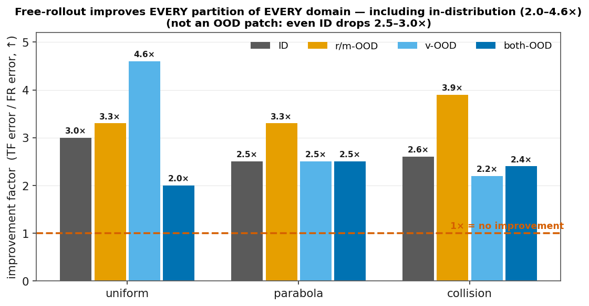
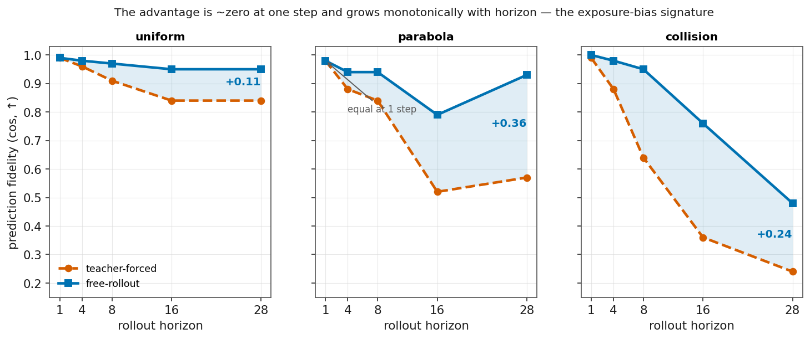
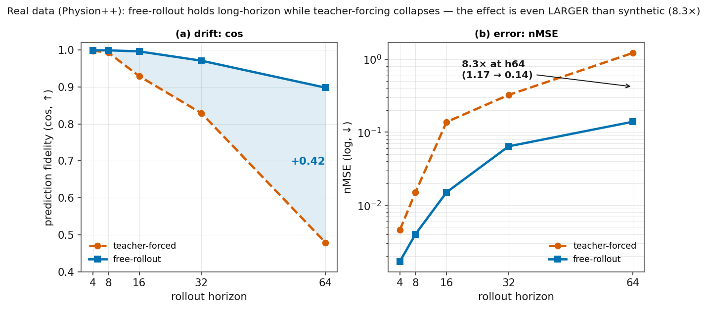

# 论据:free-rollout 是提升模型性能的主升力(全面、跨域、可归因)

> # 🎯 一句话结论
> **只翻转 teacher-forcing（TF） → free-rollout(FR) 这一个开关,在三合成域 + 真实 Physion++ 直训 + zero-shot 迁移上一致提升性能——每个 OOD 分区、连 ID 都提升 (2.0–4.6×),优势随 rollout 长度单调放大;是所有干预里量级最大、种子最稳、唯一无副作用、唯一跨数据集通用的杠杆。**

**对应主张**:[01_results_ledger.md](../01_results_ledger.md) **C1** / [06_storyline.md](../06_storyline.md) 发现二① ｜ **论文位置**:paper §5.1(Table 5 headline)+ §3.3 机制

**总览图(跨数据集 TF vs FR,合成三域 + 真实 Physion++)**:

---

## 1. 对照设计 + headline(只翻一个开关,3 种子零重叠)

**受控对照**:同一个 LeWM、同一批数据、同 epoch、同 init,**只改训练方式**这一个变量:
- **Teacher forcing**(LeWM 原文默认):每步喂真值上下文,只预测下一步(`num_preds=1`)。
- **Free-rollout**:预测器**自回归喂自己的预测**滚 8 步,监督整条 rollout(`num_preds=8`)。

**headline(both-OOD nMSE↓,3 种子 3072/1234/42,mean±std;parabola 用 r/m-OOD 避 h28 爆点——both-OOD 速度也 OOD 使球 h28 飞出框、nMSE 分母除零飙百万,详见 [evaluation_traps 陷阱4](evaluation_traps.md);FR>TF 在两分区方向一致,退 r/m-OOD 只为躲除零污染,非挑分区)**:

| 域 | teacher-forced | free-rollout | 倍数 |
|---|---|---|---|
| uniform | 0.300±0.007 | **0.136±0.009** | **2.2×** |
| parabola (r/m) | 0.443±0.048 | **0.122±0.007** | **3.6×** |
| collision | 1.152±0.048 | **0.479±0.079** | **2.4×** |

**三域三种子区间完全不重叠** → 排除种子噪声;除训练方式外一切相同 → 干净归因到这个开关。出处:`/data1/likun-share/junjxu/runs/aaai_p0/rollout_{uniform,parabola,collision}_baseline_{tf,fr}_s{3072,1234,42}.log`。

## 2. 覆盖度:每个分区 × 每个域都提升(含 ID)—— 不是 OOD 补丁

不只 both-OOD。**全 4 分区 × 3 域 = 12 格,格格提升 2.0–4.6×**——一眼看图:所有柱都在"1×=无变化"红线之上,连 ID(灰)都 2.5–3×。

（nMSE↓,seed 1234;倍数=TF误差/FR误差）:

| 域 | ID | r/m-OOD | v-OOD | both-OOD |
|---|---|---|---|---|
| uniform | 0.067→0.022 (**3.0×**) | 0.431→0.130 (3.3×) | 0.173→0.037 (**4.6×**) | 0.297→0.146 (2.0×) |
| parabola | 0.046→0.019 (2.5×) | 0.412→0.125 (3.3×) | 0.391→0.159 (2.5×) | 0.743→0.292 (2.5×) |
| collision | 1.084→0.422 (2.6×) | 1.011→0.262 (**3.9×**) | 1.245→0.574 (2.2×) | 1.207→0.495 (2.4×) |

- **连 ID(分布内)都提升 2.5–3.0×** → free-rollout 不是"补 OOD 的洞",而是**从根上改善预测器**;OOD 提升是这个改善的自然结果,不是专门 patch。这堵住了"你只是过拟合了 OOD 测试"的质疑。
- 出处:`aaai_p0/rollout_{域}_baseline_{tf,fr}_s1234.log`(⚠️ 本表单种子;headline §1 已 3 种子)。

## 3. 优势只在长程出现、随步数越滚越大——这个形状只有 exposure bias 才会有(坐实"是它造成的")

> **📖 名词:exposure bias(暴露偏差)** —— 自回归序列模型的经典问题:**训练时**每步都喂**真值**上下文、模型从没见过自己的预测;**部署时**却要把**自己上一步(带误差)的预测**喂回去当输入,于是误差逐步累积、长程崩。根源是训练时"没被暴露"在自己的误差里(exposure=训练时被喂什么输入)、因而学不会纠错。这是序列建模的**标准术语**(命名一般归 Ranzato et al. 2016;Bengio et al. 2015 的 Scheduled Sampling 是解法。⚠️引文写作前核)。**free-rollout 就是它的解法**:训练时就喂模型自己的预测、暴露在累积误差里逼它纠偏。

> **先解释标题**:我们不只想说"FR 更好",还想证明**好在哪、为什么好**。exposure bias 的理论预言一个**很具体的形状**——"单步预测没差别,但误差会随 rollout 步数累积、越滚越大"。如果我们观察到的正是这个形状(h1 处 TF≈FR、差距随 horizon 单调张大),那它就**只能**由 exposure bias 解释——别的原因(过拟合 / 单步建模更强 / bug)都给不出"单步为零、长程放大"这个特定形状。所以这个形状 = exposure bias 的"指纹",看到它就把"FR 有效"从**相关**坐实为**因果**。

**单步几乎无差、越滚差距越大**——一眼看图:h1 处两线重合,之后 TF(红虚)崩、FR(蓝实)稳,中间阴影落差随 horizon 张大。

（rollout cos,TF vs FR）:

| 域 | h1 | h4 | h8 | h16 | h28 |
|---|---|---|---|---|---|
| uniform | 0.99/0.99 | 0.96/0.98 | 0.91/0.97 | 0.84/0.95 | 0.84/**0.95** |
| parabola | 0.98/0.98 | 0.88/0.94 | 0.84/0.94 | 0.52/0.79 | 0.57/**0.93**(+0.36) |
| collision | 0.99/1.00 | 0.88/0.98 | 0.64/0.95 | 0.36/0.76 | 0.24/**0.48**(2×) |

- **h1 处 TF≈FR(都近乎完美)** → 差距**不在**单步能力,**纯在长程累积**。
- **差距随 horizon 单调张大**(parabola h28 差 +0.36 cos、collision h28 翻倍) → **这正是 exposure bias 会留下的形状**:teacher forcing 训练时永不见自己的误差,部署多步 rollout 时误差滚雪球;free-rollout 训练时就暴露在累积误差里、逼它纠偏。所以"单步无差、长程放大"= 误差累积的直接观测,**把"FR 提升"从相关升级为有机制的因果**(见 §6)。
- **为什么这里用 cos 不用 nMSE?**(不是打脸"判决用 nMSE")——**幅度 claim(§1/§2 的 2.2–4.6× 倍数)全用 nMSE;只有这张"长程漂移形状"图用 cos**,因为 **parabola 的 nMSE 在长 horizon 会除零爆点(飙几万~百万,陷阱4)**,画成曲线冲上天、没法看;cos 有界 [−1,1]、三域能同图、形状干净。凡是 nMSE 不爆的地方我们就直接用 nMSE by-horizon——**Physion++(fig14 右 panel,nMSE 0.002→0.14 有界)讲的就是同一个"越滚越差"故事**。这正合"逐 horizon 用该 horizon 可靠的指标"(evaluation_traps §0),不是选择性用 cos。
- 出处:同 §2 log 的 `--- ... vs horizon ---` 段 `cos=`。

> **两个真实数据集的分工(别混淆)**:**Physion++** 有 3D 位置/速度标注 → 可**直接训 + rollout 评估**(§4,FR vs TF 正面证据);**Physion**(原版 OCP)是"接触预测"benchmark、只有二分类标签、**无 rollout 连续状态标注** → 只能做**zero-shot 迁移评估**(§5,冻结 encoder + readout 分类)。所以 free-rollout 的"直训"只在 Physion++——不是漏了 Physion 直训,是 Physion 的任务形态不支持世界模型 rollout 直训。数据:Physion++ `/data1/.../runs/physionpp/`;Physion 原版 `/data1/likun-share/junjxu/physion_raw/`。

## 4. 真实数据(Physion++ 直训):效果更大(8.3×)+ 长 rollout 协同单调提升

**FR vs TF(h64,3 种子,3v3 零重叠)**:nMSE **1.174 → 0.141(8.3×)**、cos **0.50 → 0.89**。合成 2.2–3.6× → 真实 **8.3×**:**越真实、动力学越复杂,误差累积越猛,FR 收益越大**——这是"跨合成/真实通用"最有力的证据(不是简单合成域侥幸)。一眼看图:左 cos 落差随 horizon 张大(+0.42),右 nMSE(log)h64 差 8.3×。

**长 rollout 与 FR 协同(num_preds↑,h64 nMSE↓,无拐点)**:np8 0.280 → np20 0.220 → np20+scale 0.087 → **np28+scale 0.014(1/19)**。FR 是长 rollout 的载体,两者叠加把真实长程打到基线 1/19。

出处:`/data1/.../runs/physionpp/eval_pp_{tf,fr}_s{3072,1234,42}.log`、`eval_pp_fr_{np20,np20sc,np28sc}_e20*.log`;[physionpp §3.6、§3.8](../../physion/physionpp_ood_longhorizon.md)。

## 5. zero-shot 迁移:唯一逼近 random 天花板

phyworld→Physion OCP(mean AUC↑,天花板=random 架构先验 0.607):**free-rollout 0.603 = 全场最高、唯一逼近天花板**;物理结构越强越差(pos_weight 0.551=最差)、增广无用(0.597)。→ 连"迁移"这个最难设定,FR 也是最好的那个。

出处:[transfer_improvement_report.md §1](../../physion/transfer_improvement_report.md)。

## 6. 机制:为什么有效(exposure bias)+ 为什么别的方法当不了主升力

**机制**(5-27 rollout 实验的因果解释,与 §3 数据吻合):TF 单步 cos 0.98–0.99 但多步漂移,漂移速度 = f(动力学复杂度) uniform<parabola<collision——TF 训练永远看真值、**掩盖误差累积**,部署时误差滚雪球;FR 训练即暴露在自身累积误差里、学会纠偏。这是经典 **exposure bias**(Scheduled Sampling, Bengio 2015)——所以论文**不 claim 它是新方法**,claim 的是"**在物理世界模型上,这个训练协议压倒一切物理结构先验**"这个系统证据。

**为什么别的干预当不了"通用主升力"**(对比,凸显 FR 唯一性):

| 设定 | free-rollout | 物理结构 | 增广 |
|---|---|---|---|
| 合成直训 | ✅ 2.0–4.6×(全分区) | ❌ 29/30 格不改善 | ✅ 域特定最强 |
| 真实直训(Physion++) | ✅ 8.3× | ❌ 全损害长程 | ❌ appearance 反转 100× |
| zero-shot 迁移 | ✅ 唯一逼近天花板 | ❌ 越强越差 | ❌ 无用(0.597) |

**只有 free-rollout 三处都正向、且无副作用** → 唯一跨合成/真实通用的主升力。

## 7. 审稿人预案(已知可攻击点)

- **"free-rollout = scheduled sampling"**:主动承认并引用(Bengio 2015 / Data-as-Demonstrator / professor forcing);claim 是**相对重要性**(协议 > 结构),不是方法新。
- **"你只是过拟合 OOD"**:§2 显示 **ID 也提升 2.5–3.0×** → 不是 OOD-specific patch。
- **"是相关不是因果"**:§3 显示优势在 h1 为零、随 horizon 单调放大——这个"单步无差、长程越滚越大"的形状正是误差累积(exposure bias)独有的,别的原因给不出,故是因果非泛泛变好。
- **TF/FR 对照里 batch size 也变了**(np1=128、np8=64,为适配序列长度):2–8× 效应远超任何 batch size 能解释,且三域三种子一致。较真可补 batch 固定对照(P1 可选)。
- **单 backbone(ViT-tiny)**:训练动力学结论建议更大 backbone 复验(conclusion limitations)。
