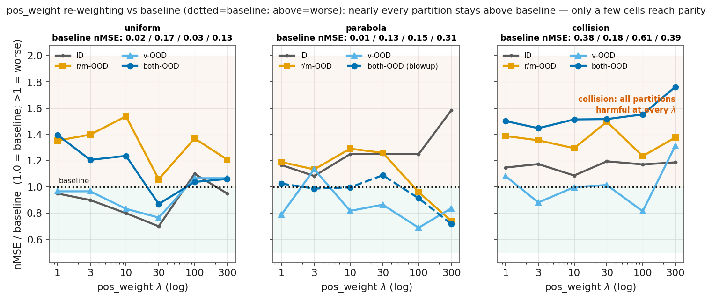
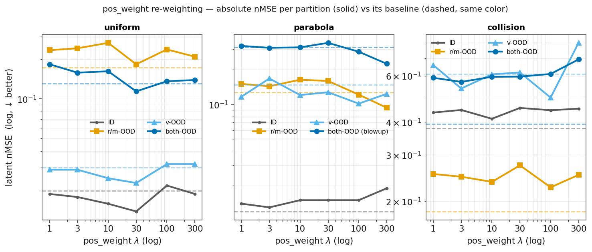

# 论据:pos_weight 加权 / LBR —— 机制验证,不是提升方法

> # 🎯 一句话结论
> **pos_weight 加权(LBR)不是提升方法,而是机制的可证伪验证:把 slot 在 loss 里的占比从 1 加到 300,4 个域×分区里只有 2 个救回与 baseline 持平、其余全程有害(collision 还越加越差)——证明"预测不依赖物理 slot"(占比低+被黑盒旁路绕过)修不了根本,物理结构整体仍是负效果、无净增益。**

**对应主张**:[01_results_ledger.md](../01_results_ledger.md) **C5** / [06_storyline.md](../06_storyline.md) 机制(第6步)
**论文位置**:paper §4.5(sec:lbr,Table 4)
**⚠️ 讲述纪律**:这条经历过"单种子净超 → 三种子降为持平"的反转,**最容易被讲错成"我们的 LBR 提升了 OOD"**。正确说法:**pos_weight 加权把结构从"有害"救回"无害共存",并借此验证"预测不依赖 slot(占比低+被旁路绕过)"这个机制;它本身不带净鲁棒性提升。**

---

## 0. 一句话结论

**pos_weight 加权不是提升方法,而是"预测不依赖 slot"这个机制的可证伪验证——而且验证是"部分成立、修不了根本"**:物理 slot 失效的根因是它**在预测 loss 里占比极低(~1% 梯度)、又被黑盒的冗余位置副本绕过**(即预测不依赖它);机制预测"提高它在 loss 里的占比就该不再有害",于是给 slot 在 pred_loss 里加权(pos_weight)。全曲线(pw 1→300)扫下来:**加权后物理 slot 在多数域×分区上仍损害性能**——把权重加到头,只有 2 个域×分区能救回与 baseline 持平(uniform·both-OOD 于 pw≥30、parabola·r/m 于 pw≥100),另 2 个任何权重都救不回(uniform·r/m 全程 0.21–0.26、collision 全程 0.59–0.69 且**越加越差**)。所以加权**只证明了机制方向对**(提高占比确实能在 slot 占主导的那个格子消掉危害),但**修不了根本**(黑盒旁路还在),整体上加权后物理结构依然是负效果、更无净增益。逐格数据见 §2。

## 1. 背景:为什么预测不依赖 slot = 占比极低 + 被旁路绕过(机制)

两件事合力:①**占比极低**——物理 slot 只占 192 维 latent 的 2 维、平均 pred_loss 里 ~1% 梯度;②**被旁路绕过**——黑盒 190 维冗余编了同一份位置(probe-190 实测:钉了 slot 后黑盒仍解出位置 ρ 0.79–0.92),预测/解码走黑盒就够、不必经过 slot。约束确实生效(structured_loss 2.53→0.015、slot 可解码 0.31→0.96)但预测**不依赖**它——行为证据见 [why_physics_structure_fails.md](why_physics_structure_fails.md)。→ 可证伪预测:**给 slot 加权提高占比,both-OOD 危害应消失(但旁路仍在,故不修根本)。**

## 2. 全曲线逐格数据(pos_weight 1→300 × 全 4 分区,nMSE↓,单种子 3072)

**趋势图(纵轴=相对 baseline 的倍数,虚线 1.0=baseline;线在虚线之上=比 baseline 差、之下=更好)**:

一眼看懂:**几乎所有分区曲线都压在 baseline(1.0)之上=加权后仍比纯 FR 差**。uniform 只有 both-OOD 在 pw30 触到 baseline(0.87);parabola 高权时 r/m/v 掉到 baseline 下(但 ID 反升、both 有爆点⚠);**collision 全 4 分区、全 λ 都在 baseline 之上、且 both 越加越差**。精确数字见下表。

**判决分区摘要(多种子,headline)**:

| 域 · 判决分区 | baseline | pw1 | pw3 | pw10 | pw30 | pw100 | pw300 | 加权到头 |
|---|---|---|---|---|---|---|---|---|
| uniform · both-OOD | 0.136±0.007 | 0.162 | 0.158 | 0.164 | **0.132** | 0.140 | 0.139 | **持平**(pw≥30) |
| parabola · r/m-OOD | 0.122±0.007 | 0.151 | 0.144 | 0.164 | 0.160 | 0.138 | 0.106 | 持平(pw≥100) |
| collision · both-OOD | 0.393 | 0.590 | 0.569 | 0.595 | 0.596 | 0.610 | **0.693** | **越加越差** |

（uniform·both / parabola·r/m 为 3 种子均值;其余为单种子 3072。）

**全 4 分区逐格(单种子 3072;每域 ID / r/m-OOD / v-OOD / both-OOD 全给)**:

*uniform*（baseline 各分区:ID 0.020 / r/m 0.173 / v 0.030 / both 0.131）
| 分区 | pw1 | pw3 | pw10 | pw30 | pw100 | pw300 |
|---|---|---|---|---|---|---|
| ID | 0.019 | 0.018 | 0.016 | 0.014 | 0.022 | 0.019 |
| r/m-OOD | 0.234 | 0.242 | 0.266 | 0.183 | 0.237 | 0.209 |
| v-OOD | 0.029 | 0.029 | 0.025 | 0.023 | 0.032 | 0.032 |
| both-OOD | 0.183 | 0.158 | 0.162 | **0.114** | 0.136 | 0.139 |

*parabola*（baseline:ID 0.012 / r/m 0.127 / v 0.148 / both 0.313）
| 分区 | pw1 | pw3 | pw10 | pw30 | pw100 | pw300 |
|---|---|---|---|---|---|---|
| ID | 0.014 | 0.013 | 0.015 | 0.015 | 0.015 | 0.019 |
| r/m-OOD | 0.151 | 0.144 | 0.164 | 0.160 | 0.122 | **0.094** |
| v-OOD | 0.117 | 0.168 | 0.121 | 0.128 | 0.102 | 0.124 |
| both-OOD ⚠️ | 0.321 | 0.309 | 0.312 | 0.341 | 0.286 | 0.225 |

*collision*（baseline:ID 0.379 / r/m 0.183 / v 0.609 / both 0.393）
| 分区 | pw1 | pw3 | pw10 | pw30 | pw100 | pw300 |
|---|---|---|---|---|---|---|
| ID | 0.435 | 0.445 | 0.412 | 0.453 | 0.444 | 0.450 |
| r/m-OOD | 0.254 | 0.248 | 0.237 | 0.274 | 0.226 | 0.252 |
| v-OOD | 0.659 | 0.537 | 0.608 | 0.618 | 0.496 | 0.801 |
| both-OOD | 0.590 | 0.569 | 0.595 | 0.596 | 0.610 | **0.693** |

**绝对值视角(实线=pos_weight 曲线,虚线=各分区 baseline,log 纵轴)**:

（同上数据的绝对 nMSE。看**实线相对同色虚线的位置**:uniform 的 r/m(橙)实线全程在其虚线之上=有害,both(蓝)只 pw30 掉到虚线下;parabola 高权时 r/m/v 实线掉到虚线下、但 ID 实线在 pw300 冲高越过虚线;collision 三条大分区实线几乎全程在各自虚线之上。ID/v 量级小、r/m/both 量级大,log 轴一起看。）

- ⚠️ **parabola both-OOD** 附警示:parabola 长程 h28 nMSE 有除零爆点风险(球出框→目标方差→0),此处 partition 聚合值(0.22–0.34)未爆但**判决一律以 r/m-OOD 为准**;此行仅供参考,勿单独引用。见 [evaluation_traps.md 陷阱4](evaluation_traps.md)。
- **collision ID 本就高**(baseline 0.379,冲量域连 ID 都难),pos_weight 让 ID 也略变差(0.41–0.45)——旁路+过约束在 ID 上也无益。
- 出处:`/data1/likun-share/junjxu/runs/structdyn_eval/rollout_{uniform_motion,parabola,collision}_structpos_fr_pw*_id1k.log`(pw1 的 uniform=plain structpos_fr;seed 均 3072);baseline `rollout_*_baseline_fr_id1k.log`。多种子见 [lbr_ablation §4](../lbr_ablation/PLAN.md) + `aaai_p0/rollout_*_structpos_fr_pw*_s{1234,42}`。

**读表(全分区)**:① **无 U 形**——uniform·both 加到 pw300(0.139)都不崩;② 加权到头,**全 12 个域×判决分区里只有 uniform·both、parabola·r/m 两格救回持平**,其余(含 uniform·r/m 0.21–0.27、collision 全分区、parabola·both)**全程有害**;③ collision **越加越差**(both 0.590→0.693、v 到 pw300 飙 0.801);④ **ID 也不受益**(三域 ID 大体持平或微升)。→ 加权只证明机制方向对(能消掉 slot 占主导那格的危害),但**修不了根本**(黑盒旁路还在),绝大多数格子仍负效果、无净增益。

**顺带:不同物理量进 slot 的效果(作"可能原因"的补充,不作强论证)**——同一 pos_weight 加权 slot,编码不同物理量,三域(hardest clean split):

| slot 内容 | uniform | parabola | collision |
|---|---|---|---|
| 位置(structpos) | 0.132 | 0.160 | 0.596 |
| 位置+速度(structposvel) | 0.207 | 0.096 | 0.621 |
| **Δ 加速度净效果** | **+0.075** | **−0.064** | **+0.025** |

- **位置是输出量**(各域角色同=被预测对象)→ structpos 随动力学复杂度**单调变差**(uniform 持平→parabola 小害→collision 大害),**不翻号**。
- **速度是驱动量**(域内角色异)→ 加速度净效果 **精确对应速度在该域的信息价值**:uniform 冗余常数(+0.075 害)、parabola 线性驱动(−0.064 益)、collision 不连续(+0.025 微害)。
- 这个对应大体成立,但**只当"可能原因"看,不拔高成"可预测规律/机制最强证据"**(数据点太少、parabola 提升太小)。主结论就一句朴素的:**物理量进 slot 整体有害;parabola 那点小提升(−0.026)不构成可用方法,可能因速度在抛体里可外推**。出处:structpos 三域 `rollout_{um,par,col}_structpos_fr_pw30`;structposvel 三域(par 三种子)。

## 3. 承重编码在真实数据(Physion / Physion++)上的数据 —— 两个数据集都印证 phyworld 结论

承重编码在 phyworld 上的对应物在 Physion 侧就是 **structured slot + pw30**(直训记作 `pp_struct`、迁移记作 `structpos_fr_pw30`)。两条真实数据线都有数据,结论与 phyworld 一致:**承重买到的是"位置显式可解码"(trade-off),不是长程/OOD 鲁棒;迁移侧更是全场最差。**

### 3.1 Physion++ 直训:承重损害长程 rollout(与 phyworld 同向)

4 配置 by-horizon rollout(pusht init,epoch20,np8,seed3072):

| horizon | 纯 FR | **承重(struct+pw30)** | 判断 |
|---|---|---|---|
| cos h16 | **0.994** | 0.987 | 承重略低 |
| cos h32 | **0.910** | 0.832 | 承重明显低 |
| cos h64 | **0.794** | 0.722 | 承重长程更差 |
| **nMSE h1** | **0.003** | 0.018 | 承重差 6× |
| **nMSE h64** | **0.141** | 0.266 | 承重差 1.9× |

- **纯 free-rollout 在所有 horizon 都最好,长程尤其明显**;承重(以及 consistency/accel)全部损害长程。与 phyworld C4/C5 一致:intrinsic-slot 承重物理约束无益。
- **换来的是"位置显式可解码"(真实 trade-off)**:承重让固定 slot 强制=位置,中段 friction_collision 位置解码 ρ 0.87/0.93/0.97,但整体 rollout 保真略降。→ **"整体保真 vs 物理量可解码"是真 trade-off,和 phyworld 完全一致**(承重让状态可读,不改善整体预测)。
- 出处:[physionpp_ood_longhorizon.md §1、§3.8②、§4.5](../../physion/physionpp_ood_longhorizon.md);log `/data1/likun-share/junjxu/runs/physionpp/eval_pp_{fr,struct}_e20.log`、`eval_pp_struct2.log`(h64 nMSE 0.266)、纯FR `eval_pp_fr_s3072.log`。

### 3.2 Physion zero-shot 迁移:承重全场最差(< random 天花板)

phyworld→Physion OCP 迁移(mean AUC↑,random 架构先验=天花板 0.607):

| 配置 | Physion mean AUC |
|---|---|
| random 先验(天花板) | 0.607 |
| free-rollout | 0.603 |
| appearance aug 0.5 | 0.597 |
| +consistency+accel | 0.582 |
| +consistency | 0.566 |
| **承重(pos_weight/structpos_pw30)** | **0.551(全场最差)** |

**所有配置 <random,且越加物理结构越差——承重(phyworld both-OOD 上最好的物理方法之一)迁移最差。** 已在 [figures/fig6_transfer_ceiling.png](../figures/fig6_transfer_ceiling.png) 可视化(最下面那条红 bar)。出处:[transfer_improvement_report.md §1](../../physion/transfer_improvement_report.md);`reports/physion/eval_collision_structpos_fr_pw30_id1k.json`(承重)、`eval_random_baseline.json`(0.607)。

### 3.3 三数据集合并结论

| 数据集 | 承重编码效果 | 与 phyworld 关系 |
|---|---|---|
| phyworld(合成) | 12 判决格只 2 格救回持平,其余全害;换来 pixel 可解码性(单种子) | 本体 |
| Physion++(直训) | 长程 rollout 更差(h64 nMSE 0.141→0.266),换来位置显式可解码 | **同向** trade-off |
| Physion(迁移) | 全场最差 0.551 < random 0.607 | **同向**,更极端 |

→ **承重编码在合成与真实三处一致:不带长程/OOD 净鲁棒性,只带"物理量可解码"这个可解释性 trade-off,迁移上甚至有害。** 强化了"承重是机制验证、非提升方法"的口径。

## 5. 幸存的窄正向(单种子 / 指标依赖 / 伤迁移)——属于"pos_weight 加权+运动学",非纯加权

pos_weight 加权**之后**再叠运动学头(structcv_fr_pw100),窄向收益才显现:
- **uniform pixel h28 +1.25dB**(23.34 vs 22.09)、both-OOD 21.30→21.67 dB;
- **v-OOD 解码位置 ρ 0.991/0.987**(全场最高);
- parabola both-OOD(latent)0.313→0.262(accel 学到常重力)。

但这些**只在光滑域、只在 pixel/解码尺、单种子**,且**伤 Physion 迁移**(pos_weight 加权 OCP 0.551 = 全场最差)。定性:结构买到的是**可解释性 + 短程/OOD 位置**,不是净鲁棒性。四条件缺一不可:free-rollout + pos_weight 加权 + 光滑域 + pixel 尺。出处:[kinematics_exploration.md](../../6-24/kinematics_exploration.md)。

## 6. 在论文里的角色

§4.5 机制节的**收尾验证**:机制说"失效因预测不依赖 slot" → 可证伪预测"提高 slot 占比则危害消失" → LBR 验证成立(危害消失但只到持平)。**价值 = 坐实机制,不是卖点。** 真正的正面杠杆是 free-rollout([free_rollout_evidence.md](free_rollout_evidence.md))。

## 7. 一句话(讲给导师/写作用)

> 我们不 claim pos_weight 加权"提升"了 OOD——三种子下它只把结构从有害救回与 baseline 持平(仅 uniform,富动力学域仍有害)。它的作用是**验证"预测不依赖 slot"这个机制**:结构失效的根因是预测不依赖它(占比低+被旁路绕过),提高占比危害就消失,但结构即便被加权也不带净鲁棒性。
