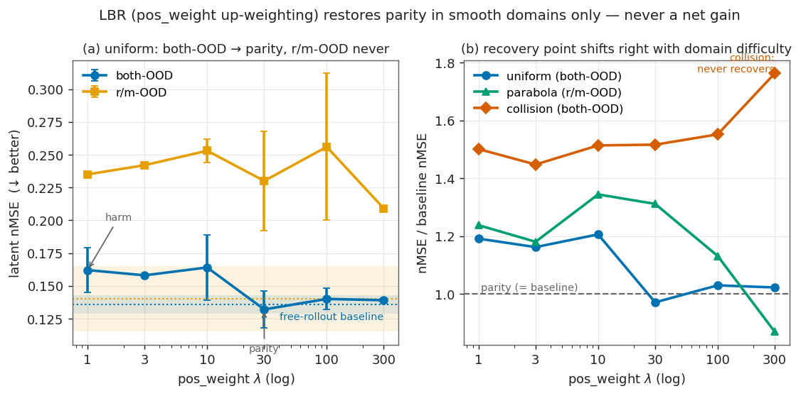

# LBR（pos_weight 承重）消融 —— 计划与结果

**日期**：2026-07-13
**目的**：把论文机制主张 *"物理 slot 非承重 → 加权(LBR)后危害消失、回到持平"* 从单种子轶事升级为**带误差棒的转变曲线**，并探两端看是否 U 形（过度加权把 pred_loss 挤崩 → 性能掉头 = "承重是平衡问题"的完整机制证据）。
**喂给**：[../aaai_paper/](../aaai_paper/) §4.4 LBR / Fig.4 机制面板（C5）。

## 1. 已有基础（勿重复）

- uniform structpos_fr 单种子曲线（2026-07-05，seed 3072）：pw1→0.183、pw10→0.162、pw30→0.114、pw100→0.136（both-OOD nMSE↓；baseline_fr=0.131）。
- P0-4（paper session）：pw30 三种子 = **0.132±0.014**，vs baseline_fr 三种子 0.136±0.007 → **latent 增益在种子噪声内**（C5 已降级为"回到持平"）。
- 结论口径：LBR 的正确 claim 是 **harm→par 转变**（0.18→0.13），不是净增益。

## 2. 本轮跑什么（8 run，2026-07-13 已全部 launch，8 卡并行）

配方与原曲线严格一致：uniform_motion_id1k，`loss.structured.weight=1.0`，free-rollout np8 bs64，20ep，只变 `loss.pos_weight` / `seed`。脚本 [../../6-24/run_structdyn.sh](../../6-24/run_structdyn.sh)，训完自动接 latent rollout eval。

| run（GPU） | pos_weight | seed | 作用 |
|---|---|---|---|
| pw3（0） | 3 | 3072 | 低端过渡点 |
| pw300（1） | 300 | 3072 | **高端：探 U 形回落** |
| pw1_s1234（2）/ pw1_s42（3） | 1 | 1234/42 | pw1 凑 3 种子 |
| pw10_s1234（4）/ pw10_s42（5） | 10 | 1234/42 | pw10 凑 3 种子 |
| pw100_s1234（6）/ pw100_s42（7） | 100 | 1234/42 | pw100 凑 3 种子 |

完成后曲线：**pw∈{1,3,10,30,100,300}，{1,10,30,100} 各 3 种子**；参照线 = baseline_fr 三种子（P0-1，0.136±0.007）。

产物：ckpt `$STABLEWM_HOME/uniform_motion_structpos_fr_pw*`；日志 `/data1/likun-share/junjxu/runs/structdyn_eval/{train,rollout}_uniform_motion_structpos_fr_pw*`；监听器 bfod41374（带 OOM 检测；显存紧 co-locate）。

## 2b. Phase 2：跨域曲线（parabola / collision，链式排队中）

**动机**：其余两域在本配方下只有 pw30 单点，且这两个单点已暗示**边界条件故事**——parabola pw30=0.341（vs baseline 0.313，≈略差没拉回）、collision pw30=**0.596**（vs 0.393，**完全没救回**）。跨域曲线验证的不是"LBR 有效"，而是论文的边界条件主张：**LBR 只在光滑域把 harm 拉回 par；collision 是否任何权重都救不回**（若是 → "承重必要非充分"机制更完整）。

| run | 域 × pos_weight | seed |
|---|---|---|
| 10 个 | {parabola, collision} × pw{1, **3**, 10, 100, 300} | 3072（单种子；误差棒由 uniform 曲线承担） |

加上已有 pw30 = **每域 6 点、与 uniform 完全同网格 {1,3,10,30,100,300}**（论文图三域同 x 轴、无缺点位）。10 job > 8 卡 → **两波**：wave1 = pw{1,10,100,300}×2 域（8 卡各 1）；≥2 个完成腾出槽后 wave2 = pw3×2 域（自动挑最空的卡）。**链式启动器** [run_phase2.sh](run_phase2.sh)（setsid，PPID=1，2026-07-13 01:09 重启为两波版）盯 phase 1 全完成后自动执行整个流程，不依赖 session 存活。

## 3. 判读

- 主指标 both-OOD nMSE（各点均值±std）；辅看 r/m-OOD、h28。
- uniform 预期：pw1 显著差于 baseline（harm）→ pw10-100 回到与 baseline 重叠（par）→ pw300 若再掉头 = U 形加分项。
- 跨域预期：parabola 温和版同型曲线；collision 全曲线维持 harm（任何权重救不回）→ 支撑四边界条件。
- ⚠️ parabola 判读用 **r/m-OOD**（both-OOD 长程 nMSE 有除零爆点，见 memory `parabola-bothood-nmse-blowup`）。
- 若 3 种子后某点均值±std 与单种子结论翻转 → 以 3 种子为准，同步 ledger 更正。

**种子策略（效应量 vs 噪声）**：多种子只在"效应量≈种子噪声"时必要。依据：P0 实测 uniform pw30 单种子的"增益"（0.114 vs 0.131）在 3 种子下消失（0.132±0.014 vs 0.136±0.007，C5 因此降级）——种子噪声 ±0.007~0.014，能吞掉 ~0.02-0.05 级差值。
- uniform：转变效应 ~0.05 ≈ 噪声 → **3 种子**（phase 1 在补）。
- collision：harm 效应 +0.2 ≈ 噪声 4-10×（其种子 spread 实测 ~±0.02-0.05）→ **单种子够**，支撑"任何权重救不回"的定性结论。
- parabola：**自适应**——曲线出来后，仅当某点要支撑"持平/拉回"类小差值结论（<~3×噪声）时，对该点补 2 种子；纯形状结论不补。

## 4. 结果

### 4.1 Phase 1：uniform 完整曲线（2026-07-13，均值±std，3 种子=3072/1234/42）

**both-OOD nMSE↓**（参照 baseline_fr 3 种子 = **0.136±0.007**）：

| pos_weight | 1 | 3* | 10 | 30 | 100 | 300* |
|---|---|---|---|---|---|---|
| both-OOD | 0.162±0.017 | 0.158 | 0.164±0.025 | **0.132±0.014** | 0.140±0.008 | 0.139 |

**r/m-OOD nMSE↓**（参照 baseline_fr 3 种子 = **0.140±0.025**）：

| pos_weight | 1 | 3* | 10 | 30 | 100 | 300* |
|---|---|---|---|---|---|---|
| r/m-OOD | 0.235±0.001 | 0.242 | 0.253±0.009 | 0.230±0.038 | 0.256±0.056 | 0.209 |

（* = 单种子。原始值见 `/data1/.../structdyn_eval/rollout_uniform_motion_structpos_fr_pw*` + `/data1/.../aaai_p0/`。）

### 4.2 判读（三个发现，第 3 个改写 C5）

1. **both-OOD：harm→par 转变成立但浅**——pw1/3/10 温和 harm（+0.026，~1.5σ），转变点在 10→30 之间，pw30 起持平（0.132±0.014 vs 0.136±0.007）。**无 U 形**：pw300 仍持平（0.139），到 300× 都没有过度加权崩溃。
2. **pw1 的"harm"比单种子印象温和**：原单种子 0.183 是抽到差种子（另两颗 0.141/0.163），3 种子均值 0.162。诚实口径：uniform 上 slot 的 both-OOD 危害是**温和**的（+0.026±噪声边缘），大 harm 在别处（collision 0.596、from-scratch +0.558）。
3. **⚠️ 新发现（改写 C5）：LBR 在 r/m-OOD 上任何权重都救不回**——全曲线 0.21-0.26，全部显著高于 baseline 0.140±0.025（+0.07-0.12，≥2σ；pw1 三种子 spread 仅 ±0.001，效应极实）。之前"pw30 部分拉回 r/m（0.183）"是单种子假象（3 种子 0.230±0.038）。**LBR 的正确表述收窄为：只在 both-OOD 上恢复持平；r/m-OOD 的 slot 危害在 λ∈[1,300] 全程存在。**

**交接 ledger（C5 更新）**：LBR = "both-OOD parity-restoring, never gain, r/m-OOD harm persists at all λ" —— 机制解释仍成立（加权改变承重），但"修复"范围比原表述更窄，写作时按此收口。

### 4.3 Phase 2：跨域曲线（2026-07-13 出数，单种子 3072 除注明外）

**collision（both-OOD nMSE↓，baseline_fr=0.393）——LBR 全程救不回，边界条件坐实**：

| pw | 1 | 3 | 10 | 30 | 100 | 300 |
|---|---|---|---|---|---|---|
| both | 0.590 | 0.569 | 0.595 | 0.596 | 0.610 | **0.693** |

全曲线 deep-harm（+0.18~0.30，效应 ≥4× 种子噪声，单种子即可定论），高权重端反而更差。**"LBR 只在光滑域把危害拉回持平；冲量域任何权重都救不回"** ✅。

**parabola（r/m-OOD nMSE↓，baseline 3 种子=0.122±0.007；both-OOD 因 h28 爆点弃用——本批全部 h28 nMSE 1e5 级，再次验证爆点仅 parabola 特有）**：

| pw | 1 | 3 | 10 | 30 | 100 | 300 |
|---|---|---|---|---|---|---|
| r/m | 0.151 | 0.144 | 0.164 | 0.160 | 0.122 | **0.094**⚠️ |

上表 pw100/300 已是 **3 种子均值**：pw100=0.138±0.026（3072/1234/42 = 0.122/0.167/0.124）、**pw300=0.106±0.014**（0.094/0.099/0.126）。单种子曾看到 pw300=0.094 像 gain，但 **3 种子 0.106±0.014 与 baseline 0.122±0.007 重叠在噪声内 → 是持平不是 gain**（又一次单种子造假象，和 uniform pw30 同坑）。低权重温和 harm → pw100/300 回到持平。

**三域合并图景（转变点随域难度右移）**：uniform λ≥30 拉回持平（无 U 形到 300）；parabola λ≥100 持平（**无 gain**）；collision 任何 λ 都在 deep-harm、高权端更差。

### 4.4 图

- **(a) uniform**：both-OOD（蓝）从 harm 落回基线带、r/m-OOD（橙）全程在基线带之上救不回——LBR 只修 both、不修 r/m。
- **(b) 三域 ratio-to-baseline**：转变点随域难度右移；collision 一路 >1.4 且翘尾。（注：parabola pw300 点落到 ~0.87 但 3 种子与基线重叠，是持平非 gain，见 §4.3。）

## 5. 结论（交接 ledger / C5 定稿）

**LBR = "both-OOD parity-restoring, never a net gain; r/m-OOD harm persists at all λ; impulsive domain (collision) unrecoverable at any λ."** 机制解释成立（加权改变承重、消掉 both-OOD 危害），但"最小修复"适用范围窄——不是全分区、不是全域修复。这个"修复不完整"本身是承重机制的进一步证据（r/m 危害来自编码被外观带偏，权重救不了，只有增广能治——与增广发现自洽）。**论文里 LBR 按"边界条件受控验证"写，别当 SOTA 修复。**

## 6. 原始数据源（供后续拉数）

| 内容 | 路径 |
|---|---|
| uniform pw 曲线 + 种子 rollout | `/data1/likun-share/junjxu/runs/structdyn_eval/rollout_uniform_motion_structpos_fr_pw{1,3,10,30,100,300}*_id1k.log`（种子后缀 `_s{1234,42}`） |
| parabola/collision pw 曲线 | `/data1/.../structdyn_eval/rollout_{parabola,collision}_structpos_fr_pw*_id1k.log` |
| baseline_fr 3 种子 | ⚠️ **三种子文件名不一致**:seed 1234/42 → `raw_data/runs/aaai_p0/rollout_{uniform,parabola}_baseline_fr_s{1234,42}.log`;**seed 3072(默认种子)无 `_s` 后缀、且在另一目录、域名叫 `uniform_motion`** → `raw_data/runs/structdyn_eval/rollout_{uniform_motion,parabola}_baseline_fr_id1k.log`(不存在 `_s3072` 文件) |
| 训练日志/ckpt | 同名 `train_*.log`；ckpt `$STABLEWM_HOME/{uniform_motion,parabola,collision}_structpos_fr_pw*` |
| 判读指标提取 | 段 `latent fidelity (pred vs real emb) ... by partition` 里 `both-OOD`/`r/m-OOD` 的 `nMSE=`；⚠️ parabola 用 r/m-OOD（both-OOD h28 除零爆点） |
| 图 | `reports/7-11/figures/fig1_lbr_ablation.{png,pdf}`、脚本 `make_figures.py`（原始值内嵌） |
