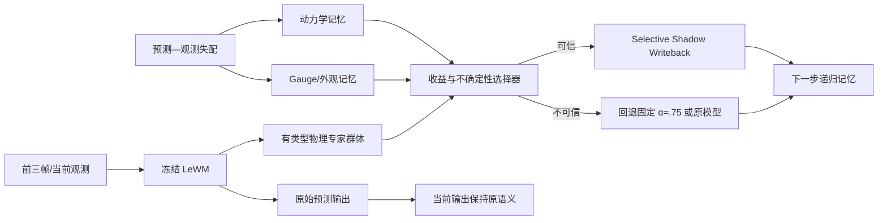

# EvoShadow ICLR 项目总报告

更新日期：2026-08-16
项目路径：`/home/likun-share/junjxu/wm`

> 本文件是 `reports/iclr_gipp/` 的当前权威总览。早期文档继续保留为实验台账；若状态或结论冲突，以本报告及机器可读结果 `evoshadow_summary.json` 为准。

## 1. 执行摘要

本项目研究的问题是：**如何在不破坏视觉世界模型已有表示的前提下，修复闭环 rollout 的长程漂移，并提高动力学 OOD 下的稳定性。**

当前证据支持以下结论：

1. 直接向共享 latent 注入物理监督、固定输出投影或继续微调主预测器均不稳定，不能作为主线。
2. 零训练 Shadow-State Writeback（α=0.75）是第一个在 3 个随机种子上同时改善 h16、h28 且保持 h1 不变的配置：
   - h16 平均改善 **10.3%**；
   - h28 平均改善 **5.0%**；
   - v-OOD 平均改善 **8.8%**；
   - both-OOD 平均改善 **11.3%**。
3. 在固定 α=0.75 之上，冻结主模型、只演化外部专家记忆仍有额外空间：
   - 严格顺序在线选择：长程误差再降低 **3.13% ± 1.73%**；
   - 400 条历史反馈：再降低 **11.62% ± 6.27%**；
   - 逐轨迹 oracle 上限：再降低 **22.21% ± 5.79%**。
4. 当前历史选择器会伤害 ID，说明“自我进化”必须是**有拒绝能力的外部演化**，不能无条件改写，也不能反向更新 LeWM。
5. 最终建议方法为 **EvoShadow：冻结 LeWM + 有类型物理专家 + 动力学/gauge 双记忆 + 置信选择 + Shadow 写回**。

当前结论强度：已经证明 uniform_motion 上的方向可行，但尚未形成完整 ICLR 主结果；缺少无泄漏安全门、parabola/collision 复现、分布切换和跨数据集验证。

## 2. 研究问题与失败机制

### 2.1 真正的问题是演化误差，不是状态不可读

AAAI 阶段和本项目早期实验表明，真实帧 latent 中的位置、速度等物理状态本来就能被线性读出。退化发生在预测 latent 被递归写回后：小偏差沿闭环传播，在 h16、h28 逐渐放大。

因此，继续增加物理 slot、probe 深监督或 consistency loss，往往只是重复编码已经存在的状态，并不能保证 predictor 真正沿这些方向演化。

### 2.2 已排除或降级为对照的路线

- 固定物理 slot、位置/速度扩展 slot；
- 二阶动力学头和状态/速度 consistency loss；
- 有标签或无标签的平滑物理先验；
- 单纯提高物理损失权重；
- 固定输出投影；
- innovation/horizon 的简单启发式门控；
- correction-aware 的 5 epoch 主模型微调。

共同失败原因包括：物理项与预测项争梯度、表示有效维度塌缩、训练视野短于评测视野、错误平滑先验覆盖碰撞事件，以及 predictor 与校正后记忆发生短视共适应。

## 3. 统一实验协议

### 3.1 数据与任务

- 物理域：uniform_motion、parabola、collision；
- 当前自进化主审计：uniform_motion；
- 随机种子：1234、3072、42；
- 每个正式评测：500 条轨迹；
- 分区：ID、r/m-OOD、v-OOD、both-OOD；
- 主要 horizon：h1、h8、h16、h28；
- 主目标：长程漂移，OOD 作为关键分解指标。

### 3.2 无动作协议

PhyWorld 在本项目中按被动视频建模：

- `wm.use_action=false`；
- 转换数据使用常量 action；
- 跳过无意义的 action normalization；
- `rollout_eval_id1k.py` 默认 action-free；
- `--use-action` 只用于 privileged legacy upper bound，不进入主表。

### 3.3 公平性原则

- 同一比较共享数据顺序、初始权重和评测轨迹；
- 训练型对照必须匹配额外 epoch 和随机种子；
- 三随机种子同时报告，不挑幸运种子；
- h1–h28 同时报告，禁止只挑终点；
- oracle 只表示上限，不作为可部署结果；
- post-hoc 阈值必须明确标注，不能冒充无泄漏结果。

## 4. 方法演进

### 4.1 GIPP：冻结物理投影诊断

GIPP 在冻结 latent 上拟合位置/速度读出器，并按经验协方差度量做最小物理修正。该设计避免更新 encoder，但固定 α 投影仍会在黑盒预测正确时过度改写。

固定输出投影只保留为诊断对照。“latent physics projection”本身已有大量相关工作，不能作为论文新颖性主张。

### 4.2 Shadow-State Writeback：只修正误差传播通道

Shadow-State 不替换当前预测输出，而是：

1. 保留黑盒 predictor 的原始 latent 作为当前输出；
2. 生成经过冻结物理校正的 shadow latent；
3. 只把 shadow latent 写入下一步递归记忆。

这把物理规则放在误差传播通道，而不是监督/输出通道，是当前最可靠的机制性发现。

### 4.3 EvoShadow：外部自演化专家记忆

固定 α 无法适应轨迹异质性。EvoShadow 将 Shadow-State 扩展为一个冻结主模型的外部适应系统：



主模型 encoder、projector、predictor、readout 全部冻结。演化仅发生在专家参数、外部记忆、后验置信度和路由规则中。

## 5. 已完成结果

### 5.1 固定输出投影：未通过止损门槛

α=0.25 的固定投影在 uniform_motion 的 both-OOD 只改善约 1%–2%，h28 三种子全部退化；parabola 总体有害。α=0.5/1.0 和简单门控也没有获得跨种子稳定性。

判决：固定投影不是最终方法，只保留为普通 projection 对照。

### 5.2 零训练 Shadow α=0.75：当前基础正结果

| 种子 | h1 基线→Shadow | h16 基线→Shadow | h16 改善 | h28 基线→Shadow | h28 改善 |
|---:|---:|---:|---:|---:|---:|
| 1234 | 0.0128→0.0128 | 0.6560→0.5779 | 11.9% | 1.4857→1.3726 | 7.6% |
| 3072 | 0.0144→0.0144 | 0.6664→0.5651 | 15.2% | 1.5919→1.4962 | 6.0% |
| 42 | 0.0173→0.0173 | 0.6980→0.6699 | 4.0% | 1.5775→1.5550 | 1.4% |
| 三种子均值 | 0.0148→0.0148 | 0.6735→0.6043 | **10.3%** | 1.5517→1.4746 | **5.0%** |

分区均值：

| 分区 | baseline nMSE | Shadow nMSE | 相对变化 |
|---|---:|---:|---:|
| ID | 0.1472 | 0.1705 | **退化 15.8%** |
| r/m-OOD | 0.4585 | 0.4568 | 改善 0.4% |
| v-OOD | 0.7834 | 0.7145 | **改善 8.8%** |
| both-OOD | 0.7828 | 0.6945 | **改善 11.3%** |

补充限制：h8 从 0.1478 退化到 0.1608，约退化 8.8%。因此固定 α=0.75 证明了“长程 shadow 写回有效”，但还没有解决 ID/中程安全性。

### 5.3 训练感知 Shadow：明确负结果

3 个方法臂和 3 个等训练量对照均完成 5 epoch、500 条轨迹评测。

| 指标 | 等训练量对照 | 训练版 Shadow | 相对变化 |
|---|---:|---:|---:|
| h1 | 0.0139 | 0.0166 | 退化 19.4% |
| h8 | 0.1449 | 0.1982 | 退化 36.8% |
| h16 | 0.6605 | 0.7451 | 退化 12.8% |
| h28 | 1.5404 | 1.5155 | 改善 1.6%，但种子不一致 |
| ID | 0.1446 | 0.2523 | 退化 74.4% |
| both-OOD | 0.7708 | 0.8008 | 退化 3.9% |

判决：不再增加普通微调 epoch。主预测器会适应 8 步训练视野中的校正记忆，却没有受到 28 步稳定性约束，形成短视共适应。

### 5.4 EvoShadow α 专家池审计

专家池包含 baseline 和 Shadow α∈{0.50, 0.65, 0.75, 1.00}。每个种子 500 条轨迹，其中前 400 条作为历史流，后 100 条严格留出测试。选择上下文只使用最初 3 帧冻结 latent。

| 方法 | 长程 SSE（h≥16）↓ | h16 SSE↓ | h28 SSE↓ | 相对固定 α=.75 | 相对 baseline |
|---|---:|---:|---:|---:|---:|
| baseline | 136.999 ± 2.953 | 95.135 ± 3.603 | 147.363 ± 6.500 | -11.51% | 0.00% |
| 固定 α=.75 | 123.027 ± 7.043 | 85.393 ± 8.742 | 140.108 ± 10.959 | 0.00% | +10.24% |
| 严格顺序在线 | 119.119 ± 5.466 | 88.411 ± 13.585 | 130.980 ± 4.385 | **+3.13%** | **+13.07%** |
| 历史反馈外部记忆 | 108.479 ± 3.663 | 81.566 ± 10.044 | 120.097 ± 3.839 | **+11.62%** | **+20.77%** |
| oracle 上限 | 95.454 ± 3.131 | 74.176 ± 9.833 | 105.845 ± 5.875 | **+22.21%** | **+30.28%** |

严格顺序在线协议：测试流前 10 条使用固定 α=.75；之后只能使用已经完成的测试轨迹反馈。历史反馈协议使用 400 条历史轨迹训练外部选择器，因此不是 pure zero-shot。

当前审计采用完整信息反馈：一条历史轨迹结束并获得真实观测后，可并行回放全部轻量专家并记录其反事实误差。若部署时只能观察被选专家的损失，则需要另行评估 bandit feedback，现有数字不能直接外推。

逐种子相对固定 α=.75 的长程增益：

| 种子 | 严格顺序在线 | 历史反馈 | oracle |
|---:|---:|---:|---:|
| 1234 | +1.21% | +5.48% | +16.80% |
| 3072 | +3.63% | +11.36% | +21.53% |
| 42 | +4.56% | +18.00% | +28.31% |

分区相对固定 α=.75 的长程增益：

| 方法 | ID | r/m-OOD | v-OOD | both-OOD |
|---|---:|---:|---:|---:|
| 严格顺序在线 | -5.26% | -13.94% | +2.73% | **+8.77%** |
| 历史反馈 | -22.91% | +7.32% | +6.79% | **+20.10%** |
| oracle | +28.26% | +20.01% | +17.80% | +25.74% |

判决：

- 逐轨迹专家互补性真实存在，seed-level 汇总会低估其空间；
- 严格在线在 3 个种子总体均为正，但对 r/m-OOD 和 ID 不安全；
- 历史记忆对 both-OOD 最有效，但当前选择器可能严重伤害 ID；
- α-only 路由足以证明方向，不足以构成 ICLR 创新点。

### 5.5 安全门 post-hoc 诊断

若只有预测收益至少 10% 才离开固定 α=.75：

| 指标 | 改善 |
|---|---:|
| 全测试长程 | +9.58% |
| ID | +7.54% |
| r/m-OOD | +7.88% |
| v-OOD | +1.58% |
| both-OOD | +17.07% |
| 非固定专家覆盖率 | 17.67% |

该阈值查看过测试曲线，只能说明拒绝机制有潜力，不能作为无泄漏主结果。仅用历史流五折交叉验证选阈值时，seed 3072 的留出 ID 仍退化 79.05%，说明当前收益分数跨分布未校准。

## 6. 最终方法建议

### 6.1 冻结主干

冻结 encoder、projector、predictor 和 readout。训练版 Shadow 的失败已经表明，继续让主干适应校正分布会破坏短程和 ID。

### 6.2 有类型的物理专家

专家不应只是不同 α，而应对应明确动力学模式：

- 恒速；
- 恒加速度/重力；
- 阻尼；
- 碰撞冲量；
- 自由残差/黑盒回退。

每个专家只演化少量物理参数和 horizon-dependent 校正强度。

### 6.3 双外部记忆

- **动力学记忆**：记录速度尺度、加速度、阻尼、接触事件和专家收益，主要处理 v-OOD 与长程漂移；
- **gauge/外观记忆**：记录半径、质量、外观变化对应的 latent 坐标变换，主要处理 r/m-OOD；
- 两者在选择器处融合，但分别更新，避免把外观失配误认为动力学失配。

### 6.4 置信选择与拒绝

选择器应预测相对固定 α=.75 的收益下界，而不是单点均值。建议比较：

- bootstrap 专家方差；
- conformal risk control；
- 保序校准；
- ensemble disagreement。

当收益下界不为正时，回退固定 α=.75 或原模型。必须报告 coverage—gain 曲线和分布迁移后的阈值稳定性。

### 6.5 选择性写回

当前输出保持黑盒预测语义；只有可信校正进入下一步 shadow memory。写回方向由状态读出 Jacobian、经验协方差和 predictor 的因果响应共同限定，避免修正“可读但不承重”的冗余 latent 方向。

## 7. 创新性定位

不能声称的新颖点：

- 首次 latent physics projection；
- 首次 online system identification；
- 首次 test-time residual adaptation；
- 首次 episodic memory world model；
- α 路由本身。

建议主张的组合创新：

> 在冻结视觉世界模型上，以 gauge-equivariant、因果承重的最小物理运输构造有类型专家，并通过双外部记忆持续演化专家后验；只有经风险校准确认有益的修正才写入递归 shadow state。

相对普通方法的关键差异：

1. 不更新共享表示或主预测器；
2. 不是固定方程/固定 α，而是有类型的混合动力学；
3. 区分动力学记忆与视觉 gauge 记忆；
4. 只修正递归记忆，不覆盖当前输出；
5. 带可拒绝的风险校准，显式约束 ID 非退化。

相关工作边界：

- [WorldEvolver](https://arxiv.org/abs/2606.30639)：冻结模型的 episodic/semantic memory；
- [ReDRAW](https://proceedings.mlr.press/v331/lanier26a.html)：latent residual test-time adaptation；
- [Vid2Param](https://arxiv.org/abs/1907.06422)：从视频在线辨识物理参数；
- [LW-PR2](https://proceedings.mlr.press/v100/williams20a.html)：在线适应与灾难性遗忘风险。

## 8. 下一阶段实验计划

### P0：无泄漏安全选择器

- 用历史数据标定收益下界；
- 验收：ID 长程退化不超过 1%，both-OOD 相对固定 α=.75 改善至少 10%；
- 完整报告 coverage—gain、分区风险和阈值跨 seed 迁移；
- post-hoc 10% 门只作为上限参考。

### P1：扩大物理专家族

- 加入恒加速度、阻尼、碰撞冲量和自由残差；
- 与 α-only pool 匹配选择器容量；
- 验证收益来自物理模式，而非单纯增加候选数量。

### P2：双记忆消融

- 无记忆固定专家；
- 仅动力学记忆；
- 仅 gauge 记忆；
- 双记忆；
- 分别检查 v-OOD、r/m-OOD 和 both-OOD。

### P3：持续适应与分布切换

反馈预算取 0、10、25、50、100、200、400 条，测试 ID→OOD、OOD-A→OOD-B，报告适应速度、遗忘、错误记忆污染和恢复速度。

### P4：跨领域与跨数据集

- parabola：恒重力专家；
- collision：接触前/瞬间/后分段与冲量专家；
- PhyWorld 之外至少一个真实视频或物理数据集；
- 最终扩展到更长 horizon 和第二 backbone。

## 9. 预注册验收门槛

EvoShadow 只有同时满足下列条件才进入论文主表：

- 至少 3 个随机种子；
- h1 不退化，ID 主指标退化不超过 1%；
- h16、h28 均优于固定 α=.75；
- both-OOD 长程改善至少 10%；
- 至少两个物理域成立；
- 相同反馈预算、候选数量和计算量下优于非物理记忆/普通 MoE；
- 因果方向、gauge 等变、双记忆、拒绝门和专家类型消融均成立；
- 所有失败配置与 post-hoc 选择完整披露。

止损条件：

- 安全校准跨 seed 仍无法控制 ID 风险；
- 扩大专家族后 oracle 空间没有增长；
- shuffled/random physics 与正确物理获得相同收益；
- 改善只存在于单种子或单分区。

## 10. 当前可写与不可写的论文结论

目前可以写：

> 零训练 Shadow-State Writeback 在 uniform_motion 的 3 个随机种子上保持 h1 不变，并将 h16/h28 平均误差降低 10.3%/5.0%。在冻结主模型的前提下，历史反馈式外部专家记忆相对固定 Shadow 进一步降低 11.62% 的长程误差，并在 both-OOD 上平均降低 20.10%。

必须同时写明：

- 11.62% 使用了 400 条历史反馈，不是 pure zero-shot；
- 当前无门历史选择器会伤害 ID；
- 10% 安全门是 post-hoc；
- 自进化结果目前只在 uniform_motion 完成。

目前不能写：

- 已解决所有 OOD；
- 所有分区稳定提升；
- 安全门已经无泄漏验证；
- α-only 路由是最终创新；
- 已达到完整 ICLR 证据门槛。

## 11. 复现与产物

### 代码与报告

- 总报告：`reports/iclr_gipp/ICLR_MASTER_REPORT.md`
- 机器结果：`reports/iclr_gipp/evoshadow_summary.json`
- 逐轨迹导出：`phyworld/scripts/rollout_eval_id1k.py`
- 自进化审计：`phyworld/scripts/analyze_evoshadow_oracle.py`
- GIPP 实现：`le-wm/gipp.py`
- 主模型接入：`le-wm/jepa.py`

### 数据、权重与日志

- 自进化逐轨迹结果：`/data1/likun-share/junjxu/iclr_gipp/evoshadow_oracle/`
- 训练权重：`/data1/likun-share/junjxu/.stable_worldmodel/iclr_gipp/`
- 历史评测日志：`runs/iclr_gipp/eval/`
- 训练日志：`runs/iclr_gipp/finetune/`

### 复现命令

导出逐轨迹诊断：

```bash
CUDA_VISIBLE_DEVICES=0 \
STABLEWM_HOME=/data1/likun-share/junjxu/.stable_worldmodel \
le-wm/.venv/bin/python phyworld/scripts/rollout_eval_id1k.py \
  --domain uniform_motion \
  --max-trajs 500 \
  --ckpt /path/to/model.ckpt \
  --dump-npz /data1/likun-share/junjxu/iclr_gipp/evoshadow_oracle/run.npz
```

复算自进化结果：

```bash
le-wm/.venv/bin/python phyworld/scripts/analyze_evoshadow_oracle.py \
  --input-dir /data1/likun-share/junjxu/iclr_gipp/evoshadow_oracle \
  --output-json reports/iclr_gipp/evoshadow_summary.json
```

## 12. 历史文档索引

以下文件保留为原始实验记录，不应单独用作当前状态判断：

- `RESULTS.md`：按时间记录的实验台账；
- `AUTO_RESULTS.md`、`metrics.csv`：历史全量自动指标；
- `EVOSHADOW_FEASIBILITY.md`：自进化专项审计；
- `NOVELTY_AND_METHOD.md`：C-GERT 阶段的创新性约束；
- `IMPLEMENTATION.md`：GIPP/门控实现说明；
- `EXPERIMENT_DESIGN.md`：早期预注册实验矩阵；
- `TOMORROW_STATUS.md`：2026-08-06 的阶段状态快照。

## 13. 项目状态说明

本报告及所有实验均在远程服务器完成，本地未保存训练产物。服务器仓库已包含最新实验提交，但 GitHub HTTPS 推送仍需要有效凭据；仓库中遗留的 `127.0.0.1:18089` 代理当前不可用，直连 GitHub 网络正常。
